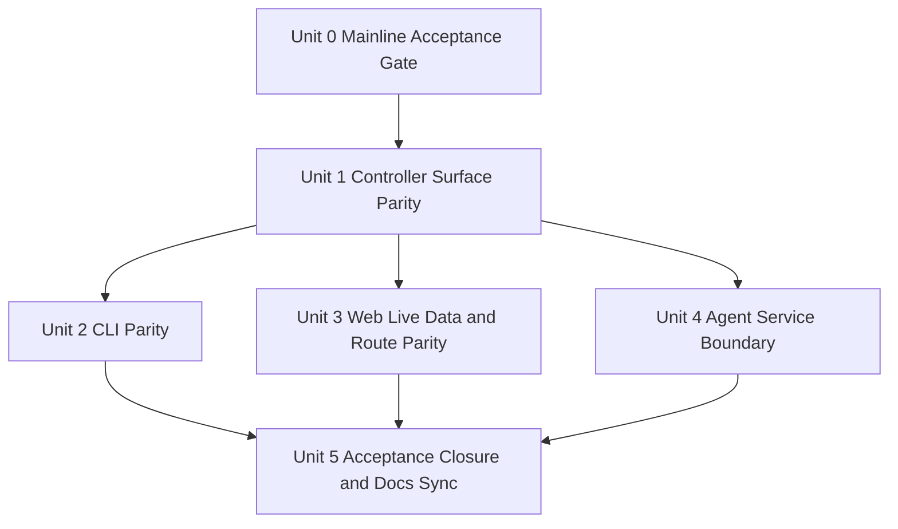
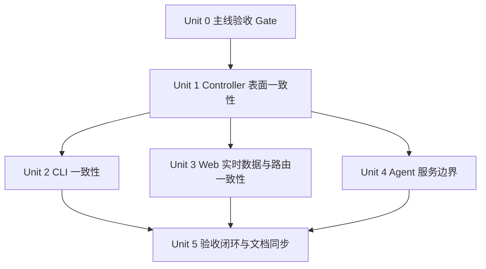

# PortManager Mainline Reconciliation Plan

Updated: 2026-04-17
Version: v0.1.4-unit5-closure

## English

## Overview

This plan is now the execution record for the Unit 0 through Unit 5 closure pass that landed on `2026-04-17`.
Its scope was to close the remaining gap between PortManager's frozen V1 contracts and the implemented branch slice without abandoning the reliability work already in place.

## Execution Update: 2026-04-17

The repository's strongest implemented asset remains an evidence-first control-plane nucleus around operations, diagnostics, backup, rollback, recovery, and event history.
That base is now matched by the previously missing public-surface closure work.
As of `2026-04-17`, Units 4 and 5 have landed: the agent serves the locked `HTTP over Tailscale` boundary, controller syncs desired state against that live service, docs truth has been resynced, and `pnpm acceptance:verify` now replays green on the same slice.

Because of that, the repeatable mainline acceptance gate should now be treated as both standing branch discipline and fresh closure evidence for Milestone 1's public surface.
It still does not imply that Milestone 2 reliability is accepted.
Active implementation focus therefore moves off parity recovery and onto Milestone 2 reliability hardening while Unit 0 remains a mandatory guardrail.

## Problem Frame

PortManager already proves backup, rollback, diagnostics, operations, drift visibility, and event history through controller, CLI, and milestone tests.
It still falls short of the broader V1 contract surface and product web information architecture described in the origin requirements document (see origin: `docs/brainstorms/2026-04-16-portmanager-mainline-progress-and-next-steps-requirements.md`).
If the project moves toward Milestone 3 or broader distributed architecture now, it will compound documentation drift and interface inconsistency instead of resolving them.

## Requirements Trace

- R1. Distinguish frozen baseline work from verified implementation work.
- R2. Make real controller, CLI, web, and agent capability boundaries explicit in shipped behavior.
- R3. Avoid claiming Milestone 1 or Milestone 2 acceptance before the missing surfaces are delivered.
- R4. Keep durable requirements and implementation guidance in repo.
- R5. Keep progress docs and roadmap surfaces synchronized as implementation lands.
- R6. Prioritize `hosts`, `bridge-rules`, `exposure-policies`, live web parity, and controller-agent steady-state integration before Milestone 3.
- R7. Preserve and extend the current reliability slice rather than discarding it.
- R8. Keep a repeatable local and CI acceptance gate in place without overstating milestone status.

## Scope Boundaries

- Do not redesign the V1 product boundary, milestone sequence, or `Toward C` strategy.
- Do not remove public resources from the contract because current code is missing them.
- Do not replace the current controller, CLI, or agent stacks with new languages or frameworks.

### Deferred to Separate Tasks

- Milestone 3 distributed-platform expansion: only after Milestone 1 acceptance closure and Milestone 2 acceptance evidence.
- Broad-platform support beyond the first Ubuntu 24.04 target: future iteration after controller-agent boundary is credible.

## Context & Research

### Relevant Code and Patterns

- `apps/controller/src/controller-server.ts` already shows the repository's current REST/SSE routing style, operation enqueueing, and async runner integration.
- `apps/controller/src/operation-store.ts` centralizes operation, backup, rollback-point, and diagnostics persistence patterns; new host/rule/policy surfaces should extend this store rather than fork parallel state paths.
- `crates/portmanager-cli/src/main.rs` already implements controller-backed read commands, `--json`, and wait-aware operation polling; new CLI surfaces should match this contract-first shape.
- `apps/web/src/main.ts` already holds the visual shell, typography, and evidence-heavy layout language; the next web phase should replace mock state and add routes without discarding the established shell.
- `crates/portmanager-agent/src/main.rs` already defines runtime-state, snapshot-manifest, and rollback-result file shapes; steady-state agent work should preserve these artifacts while adding network service behavior.
- Existing tests in `tests/controller/`, `tests/milestone/`, `tests/web/`, `crates/portmanager-cli/tests/`, and `crates/portmanager-agent/tests/` provide the verification style to extend.

### Institutional Learnings

- No repo-local `docs/solutions/` entries were present during this planning scan.

### External References

- None used. Current repo contracts and code patterns are sufficient to plan the next step.

## Key Technical Decisions

- Keep the completed Unit 0 delivery discipline layer in place before more feature work: one local command and one mainline CI workflow should continue exercising the same verification matrix.
- Extend the existing controller store and runner instead of adding a second state-management path for hosts, rules, and policies.
- Add controller surface parity before deepening agent distribution work, because web and CLI cannot become truthful first-class peers without these resources.
- Replace web mock data incrementally: wire controller-backed reads and event streams first, then add missing pages and detail surfaces.
- Evolve the agent from CLI skeleton to steady-state service in-place, preserving current file artifact formats so diagnostics, snapshot, and rollback evidence stay compatible.
- Keep contract generation in the loop whenever public surfaces move, so docs, controller, CLI, and web stay aligned.

## Open Questions

### Resolved During Planning

- Should Milestone 3 work begin before interface parity closes? No. Interface parity and steady-state agent integration must land first.
- Should current reliability work be rolled back to reduce scope? No. It should be kept and used as the verified base for acceptance closure.
- Should a mainline acceptance gate be treated as a roadmap reorder? No. It is a precondition for truthful delivery, not a substitute for missing surface parity.

### Deferred to Implementation

- Whether host/rule/policy writes should land in one controller PR or a thin read-first slice followed by write operations.
- Whether the agent steady-state service should live in `crates/portmanager-agent/src/main.rs` initially or be split into a new `service` module once routing complexity appears.

## High-Level Technical Design

## Implementation Units

- [x] **Unit 0: Mainline Acceptance Gate and CI Baseline**

**Goal:** Formalize one repeatable verification entrypoint for local development and mainline CI so branch health is checked consistently before milestone status language moves.

**Requirements:** R1, R4, R5, R7, R8

**Dependencies:** None

**Files:**
- Modify: `package.json`
- Create: `scripts/acceptance/verify.mjs`
- Create: `.github/workflows/mainline-acceptance.yml`
- Modify: `README.md`
- Modify: `docs/specs/portmanager-milestones.md`
- Modify: `TODO.md`

**Approach:**
- Add a single local command that runs the same validation sequence the repository already depends on: tests, type checks, Rust workspace tests, contract drift checks, docs build, and milestone verification.
- Mirror that sequence in GitHub Actions for `pull_request`, `push` to `main`, and `workflow_dispatch`.
- Treat the result as branch-discipline evidence, not as automatic milestone acceptance.

**Patterns to follow:**
- Existing docs-pages workflow in `.github/workflows/docs-pages.yml`
- Existing milestone verification command shape in `package.json`

**Test scenarios:**
- Happy path: local `pnpm acceptance:verify` succeeds from repo root.
- Happy path: CI job provisions Node, pnpm, Rust, and both dependency roots, then runs the same acceptance command.
- Error path: the local runner fails fast on the first broken step and returns a non-zero exit code.
- Error path: docs generation drift or contract drift fails the same gate rather than silently passing.

**Verification:**
- `pnpm acceptance:verify` is the canonical mainline verification entrypoint, is wired into GitHub Actions, and latest `main` runs `24565361391` / `24565361388` prove the gate is green on GitHub-hosted runners.

- [x] **Unit 1: Controller Host, Rule, and Policy Surface Parity**

**Goal:** Implement the missing contract-backed controller resources so the repository serves real `hosts`, `bridge-rules`, and `exposure-policies` data and mutations instead of only operations/reliability slices.

**Requirements:** R2, R3, R6, R7

**Dependencies:** Unit 0

**Files:**
- Modify: `apps/controller/src/controller-server.ts`
- Modify: `apps/controller/src/operation-store.ts`
- Create: `tests/controller/host-rule-policy.test.ts`

**Approach:**
- Add controller read and write paths for hosts, bridge rules, and exposure policies by extending the existing store and operation runner.
- Keep operation creation, rollback evidence, and degraded-state semantics consistent with current backup and diagnostics flows.
- Reuse the already-frozen contract surface without changing generated outputs, because OpenAPI already declared these Unit 1 resources.

**Patterns to follow:**
- `apps/controller/src/controller-server.ts`
- `tests/controller/drift-reliability.test.ts`
- `tests/milestone/one-host-one-rule.test.ts`

**Test scenarios:**
- Happy path: create or update a host, bridge rule, and exposure policy through the controller and observe contract-aligned responses.
- Happy path: controller list/detail endpoints expose the same host/rule/policy state consumed later by CLI and web.
- Edge case: missing host or rule identifiers return explicit 404 or validation failures, not silent no-ops.
- Error path: destructive rule mutation still records backup and rollback evidence before state changes.
- Integration: drift-check, diagnostics, and rollback views stay consistent after new host/rule/policy state is introduced.

**Verification:**
- `tests/controller/host-rule-policy.test.ts` proves real host/rule/policy surface parity, host probe/bootstrap lifecycle, backup-aware destructive rule mutation, and 404 guards alongside existing reliability primitives.

- [x] **Unit 2: CLI Public Surface Expansion**

**Goal:** Make the CLI a truthful peer to the controller for host, bridge-rule, and exposure-policy inspection and core write operations.

**Requirements:** R2, R3, R6, R7

**Dependencies:** Unit 1

**Files:**
- Modify: `crates/portmanager-cli/src/main.rs`
- Modify: `crates/portmanager-cli/tests/operation_get_cli.rs`
- Create: `crates/portmanager-cli/tests/host_rule_policy_cli.rs`

**Approach:**
- Extend the current `clap` command tree with host, bridge-rule, and exposure-policy subcommands that match controller resources and preserve `--json` behavior.
- Reuse the existing wait-aware operation polling path for write commands that enqueue work.

**Patterns to follow:**
- `crates/portmanager-cli/src/main.rs`
- `crates/portmanager-cli/tests/operation_get_cli.rs`

**Test scenarios:**
- Happy path: list and inspect hosts, rules, and policies in both text and JSON output.
- Happy path: write-oriented CLI commands surface accepted operation IDs and can optionally wait for terminal state.
- Edge case: missing or invalid controller responses produce structured JSON errors and clear text errors.
- Integration: CLI output stays consistent with controller detail payloads and operation replay URLs.

**Verification:**
- CLI tests prove contract-aligned read and write behavior for the missing public resources.
- Status update: `crates/portmanager-cli/tests/host_rule_policy_cli.rs` now proves list/get/create/probe/bootstrap for hosts, list/get/create/update/delete for bridge rules, and get/set for exposure policies.

- [x] **Unit 3: Web Live Data and Route Parity**

**Goal:** Replace mock-only web state with controller-backed data and add the missing navigation surfaces promised by the product information architecture.

**Requirements:** R1, R2, R3, R6, R7

**Dependencies:** Unit 1

**Files:**
- Modify: `apps/web/src/main.ts`
- Modify: `tests/web/web-shell.test.ts`
- Create: `tests/web/live-controller-shell.test.ts`

**Approach:**
- Introduce controller fetch and event-stream consumption into the existing web shell without discarding the current design baseline.
- Add dedicated routes or view states for `Hosts`, `Bridge Rules`, `Backups`, `Console`, and diagnostics detail, while keeping overview, host detail, and operations evidence-heavy.
- Reuse generated contract types rather than parallel view-local schemas.

**Patterns to follow:**
- `apps/web/src/main.ts`
- `tests/web/web-shell.test.ts`
- `tests/controller/event-stream.test.ts`

**Test scenarios:**
- Happy path: overview and host detail render live controller-backed state instead of mock factories.
- Happy path: operations and console surfaces consume live event history and selected-operation replay streams.
- Edge case: degraded or partially missing data renders explicit empty states or warnings instead of disappearing panels.
- Integration: hosts, bridge rules, backups, and diagnostics detail stay semantically aligned with controller payloads.

**Verification:**
- Web tests now prove live-data rendering and route parity across the locked V1 navigation model.
- Status update: `tests/web/live-controller-shell.test.ts` proves controller-backed overview, host detail, operations, hosts, bridge-rules, backups, and console views; `tests/web/web-shell.test.ts` keeps preview-mode shells aligned with the same information architecture.

- [x] **Unit 4: Agent Steady-State Service Boundary**

**Goal:** Move the agent from file-backed CLI skeleton toward the locked `HTTP over Tailscale` steady-state boundary without breaking existing artifact contracts.

**Requirements:** R2, R3, R6, R7

**Dependencies:** Unit 1

**Files:**
- Modify: `crates/portmanager-agent/src/main.rs`
- Modify: `crates/portmanager-agent/tests/agent_cli.rs`
- Create: `apps/controller/src/agent-client.ts`
- Modify: `apps/controller/src/controller-server.ts`
- Create: `tests/controller/agent-service.test.ts`

**Approach:**
- Preserve current runtime-state, snapshot, and rollback artifact formats, but add an agent service path that can serve steady-state execution over the locked controller-agent protocol.
- Keep bootstrap and rescue behavior separate from steady-state service semantics.
- Add a thin controller-side client or adapter so host and rule operations stop depending on purely local mock execution.

**Patterns to follow:**
- `crates/portmanager-agent/src/main.rs`
- `apps/controller/src/controller-server.ts`
- `crates/portmanager-agent/tests/agent_cli.rs`

**Test scenarios:**
- Happy path: controller reaches the agent through the steady-state service boundary for collect, apply, snapshot, and rollback operations.
- Edge case: agent unavailable or stale responses move affected resources into explicit degraded state.
- Error path: failed remote mutation preserves operation evidence and rollback eligibility.
- Integration: agent responses still emit artifacts compatible with existing diagnostics and backup/rollback consumers.

**Verification:**
- `crates/portmanager-agent/tests/agent_cli.rs` now proves `/health`, `/runtime-state`, `/apply`, `/snapshot`, and `/rollback` over the long-lived `serve` command while preserving existing artifact formats.
- `tests/controller/agent-service.test.ts` proves live controller-to-agent desired-state sync and explicit degraded handling when the agent is unreachable.

- [x] **Unit 5: Acceptance Closure, Roadmap Sync, and Verification**

**Goal:** Re-run the full verification matrix, update progress documents, and move the repo to a truthful Milestone 1 / Milestone 2 status after code parity lands.

**Requirements:** R1, R3, R4, R5, R6

**Dependencies:** Units 2, 3, 4

**Files:**
- Modify: `README.md`
- Modify: `Interface Document.md`
- Modify: `TODO.md`
- Modify: `docs/specs/portmanager-milestones.md`
- Modify: `docs/specs/portmanager-v1-product-spec.md`
- Modify: `docs/specs/portmanager-ui-information-architecture.md`
- Modify: `docs-site/en/roadmap/milestones.md`
- Modify: `docs-site/zh/roadmap/milestones.md`
- Modify: `docs-site/data/roadmap.ts`
- Test: `tests/milestone/one-host-one-rule.test.ts`
- Test: `tests/milestone/reliability-backup-policy.test.ts`
- Test: `tests/milestone/reliability-drift.test.ts`
- Test: `tests/milestone/reliability-event-history.test.ts`
- Test: `tests/milestone/reliability-operations.test.ts`
- Test: `tests/milestone/reliability-recovery.test.ts`

**Approach:**
- Update progress language only after controller, CLI, web, and agent evidence is verified.
- Keep roadmap stages and statuses aligned with actual acceptance state instead of aspirational labels.
- Treat docs sync as a final acceptance activity, not a substitute for missing implementation work.

**Patterns to follow:**
- `README.md`
- `docs/specs/portmanager-milestones.md`
- `docs-site/data/roadmap.ts`

**Test scenarios:**
- Integration: Milestone 1 proof covers real host/rule readiness, backup-before-mutation, rollback evidence, diagnostics evidence, and cross-surface state parity.
- Integration: reliability tests still pass after host/rule/policy and live web work land.
- Error path: docs and roadmap statuses are not advanced when verification still shows acceptance gaps.

**Verification:**
- `pnpm acceptance:verify` succeeds after the Unit 4 agent-service delivery and the Unit 5 docs sync pass, and the resulting docs now move Milestone 1 wording only after that proof stays green.

## System-Wide Impact

- **Interaction graph:** Controller routes, operation store, CLI command tree, web render flow, agent execution boundary, and the mainline acceptance gate all change together; contracts remain the shared seam.
- **Delivery discipline:** Mainline CI should fail on the same conditions as local acceptance, or branch truth will drift again.
- **Error propagation:** Controller validation and transport failures must propagate into explicit operation states and degraded signals instead of generic 500-style ambiguity.
- **State lifecycle risks:** Adding host/rule/policy persistence increases partial-write and evidence-link risks; backup and rollback association must stay atomic from the user's perspective.
- **API surface parity:** Every new controller surface must be mirrored into CLI and web consumption before milestone status changes.
- **Integration coverage:** Unit tests alone will not prove cross-surface parity; milestone verification and live web/controller integration tests remain required.
- **Unchanged invariants:** Docs-first governance, contract generation, controller-side diagnostics capture, mandatory local backup before destructive mutation, and `Toward C` gating all remain unchanged.

## Risks & Dependencies

| Risk | Mitigation |
|------|------------|
| Host/rule/policy surface expansion duplicates state logic outside `operation-store`. | Extend existing store and runner patterns; reject parallel in-memory models. |
| Web route expansion drifts from controller contracts and reintroduces mock-only behavior. | Consume generated contract types and back every new route with controller integration tests. |
| Agent service work destabilizes existing snapshot and rollback artifacts. | Preserve current artifact schemas and cover compatibility with controller and agent tests before flipping docs language. |
| Reliability slice gets blocked behind too much UI work. | Land controller and CLI parity first, then use those surfaces to drive web and agent work incrementally. |
| Acceptance gate becomes mistaken for milestone completion. | Re-state in root docs and milestone docs that `acceptance:verify` is a branch-discipline gate, not acceptance closure. |

## Documentation / Operational Notes

- Keep progress documents bilingual and preserve the existing `Updated` / `Version` metadata format where present.
- Merge work into local `main` only after verification passes and both the feature branch and source clone return to a clean working tree.

## Sources & References

- **Origin document:** `docs/brainstorms/2026-04-16-portmanager-mainline-progress-and-next-steps-requirements.md`
- Related code: `apps/controller/src/controller-server.ts`
- Related code: `crates/portmanager-cli/src/main.rs`
- Related code: `apps/web/src/main.ts`
- Related code: `crates/portmanager-agent/src/main.rs`

## 中文

## 概览

这份计划现在是 `2026-04-17` 落地的 Unit 0 到 Unit 5 闭环执行记录。
它的任务是在不丢弃当前已落地可靠性工作的前提下，补齐 PortManager 已冻结 V1 契约与实现分支之间的剩余差距。

## 执行更新：2026-04-17

当前仓库最强的已实现资产，仍然是围绕 operations、diagnostics、backup、rollback、recovery 与 event history 形成的 evidence-first 控制平面内核。
不同的是，之前缺失的公共表面闭环现在也已经补齐了。
截至 `2026-04-17`，Unit 4 与 Unit 5 都已经落地：agent 已经提供锁定的 `HTTP over Tailscale` 边界，controller 已经会通过 live service 同步 desired state，文档真相已重新同步，`pnpm acceptance:verify` 也已经在这同一条切片上重新转绿。

因此，可重复的主线验收 gate 现在既是持续生效的分支纪律，也是 Milestone 1 公共表面闭环的新鲜证据。
但它依旧不代表 Milestone 2 可靠性已经完成验收。
当前主动实现焦点应从“补齐一致性缺口”转向“继续加固 Milestone 2 可靠性”，而 Unit 0 继续作为必须保持的护栏。

## 问题框架

PortManager 已经通过 controller、CLI 与 milestone 测试证明了 backup、rollback、diagnostics、operations、drift 可见性与 event history 这条切片。
但它仍然没有覆盖原始需求文档中描述的更完整 V1 契约表面与产品 Web 信息架构（见原始文档：`docs/brainstorms/2026-04-16-portmanager-mainline-progress-and-next-steps-requirements.md`）。
如果项目此时就进入 Milestone 3 或更广的分布式架构扩展，只会进一步放大文档漂移与界面不一致，而不是解决它们。

## 需求追踪

- R1. 区分已经冻结的基线工作与已经验证的实现工作。
- R2. 在已交付行为中明确 controller、CLI、web 与 agent 的真实能力边界。
- R3. 在缺失表面补齐之前，不宣称 Milestone 1 或 Milestone 2 已完成验收。
- R4. 在仓库内保留可持续维护的需求与实现指导。
- R5. 随着实现落地，持续同步 progress docs 与 roadmap 面。
- R6. 在 Milestone 3 之前，优先补齐 `hosts`、`bridge-rules`、`exposure-policies`、live web parity 与 controller-agent 稳态集成。
- R7. 保留并扩展当前已经存在的可靠性切片，而不是把它推倒重来。
- R8. 固化一个可重复执行的本地与 CI 验收 gate，但不能因此夸大里程碑状态。

## 范围边界

- 不重设 V1 产品边界、里程碑顺序或 `Toward C` 策略。
- 不因为当前代码缺失，就把这些公共资源从契约中删掉。
- 不用新语言或新框架替换当前 controller、CLI 或 agent 技术栈。

### 延后到独立任务

- Milestone 3 的分布式平台扩展：只有在 Milestone 1 验收闭环且 Milestone 2 拿到可信证据后才进入。
- 超出首个 Ubuntu 24.04 目标之外的广平台支持：等 controller-agent 边界可信之后再推进。

## 上下文与研究

### 相关代码与模式

- `apps/controller/src/controller-server.ts` 已经展示了当前仓库的 REST/SSE 路由风格、operation 入队模式与异步 runner 集成方式。
- `apps/controller/src/operation-store.ts` 集中了 operation、backup、rollback-point 与 diagnostics 的持久化模式；新的 host/rule/policy 表面应扩展这里，而不是分叉出并行状态路径。
- `crates/portmanager-cli/src/main.rs` 已经实现 controller-backed 的读取命令、`--json` 与 wait-aware operation polling；新的 CLI 表面应沿用这条 contract-first 形状。
- `apps/web/src/main.ts` 已经承载当前 visual shell、排版与 evidence-heavy 布局语言；下一阶段 Web 工作应替换 mock state 并补页面，而不是推翻现有 shell。
- `crates/portmanager-agent/src/main.rs` 已经定义 runtime-state、snapshot-manifest 与 rollback-result 等文件形态；稳态 agent 工作应在保留这些产物的同时，补上网络服务行为。
- `tests/controller/`、`tests/milestone/`、`tests/web/`、`crates/portmanager-cli/tests/` 与 `crates/portmanager-agent/tests/` 已经提供了后续扩展应遵循的验证风格。

### 组织内经验

- 本轮规划扫描期间，仓库内没有可复用的 `docs/solutions/` 条目。

### 外部参考

- 未使用外部资料。当前仓库中的契约与代码模式已经足够支撑下一步规划。

## 关键技术决策

- 在继续扩展功能时，继续保留已经完成的 Unit 0 交付纪律：一个本地命令和一个主线 CI workflow 应持续执行同一套验证矩阵。
- 对 hosts、rules、policies 的支持应建立在现有 controller store 与 runner 上，而不是新增第二套状态管理路径。
- 在加深 agent 分布式能力之前，先补 controller 表面一致性，因为没有这些资源，web 与 CLI 无法成为真实可信的一等同行。
- Web 的 mock 数据替换应渐进完成：先接入 controller-backed reads 与 event streams，再增加缺失页面与详情面。
- agent 应在原地从 CLI skeleton 演进为 steady-state service，并保留当前文件产物格式，使 diagnostics、snapshot 与 rollback 证据保持兼容。
- 任何公共表面的变动都必须伴随 contract generation，使 docs、controller、CLI 与 web 始终维持一致。

## 开放问题

### 规划中已解决

- 是否应在 interface parity 补齐前启动 Milestone 3？不应。必须先完成 interface parity 与稳态 agent 集成。
- 是否应为了缩小范围而回退当前可靠性工作？不应。它应保留，并作为后续验收闭环的已验证基础。
- 是否应把主线验收 gate 视为路线重排？不应。它只是保证真实交付的前置条件，不是对缺失表面的一种替代。

### 留待实现阶段

- host/rule/policy 的写路径应在一个 controller PR 中一起落，还是先只落 read，再补 write。
- 稳态 agent service 最初应继续留在 `crates/portmanager-agent/src/main.rs`，还是在路由复杂度出现后拆成新的 `service` 模块。

## 高层技术设计

## 实施单元

- [x] **Unit 0：主线验收 Gate 与 CI 基线**

**目标：** 固化一个可重复执行的本地与主线 CI 验证入口，让分支健康度在里程碑状态表述变更前就能被一致校验。

**对应需求：** R1、R4、R5、R7、R8

**依赖：** 无

**文件：**
- Modify: `package.json`
- Create: `scripts/acceptance/verify.mjs`
- Create: `.github/workflows/mainline-acceptance.yml`
- Modify: `README.md`
- Modify: `docs/specs/portmanager-milestones.md`
- Modify: `TODO.md`

**方案：**
- 增加一个本地命令，按仓库现有真实依赖顺序执行测试、类型检查、Rust workspace 测试、契约漂移检查、docs 构建与 milestone 验证。
- 在 GitHub Actions 中镜像这条顺序，覆盖 `pull_request`、推送到 `main` 以及 `workflow_dispatch`。
- 把结果视为分支纪律证据，而不是自动里程碑验收。

**参考模式：**
- `.github/workflows/docs-pages.yml` 中已有的 workflow 形状
- `package.json` 中已有的 milestone verification 命令形状

**测试场景：**
- Happy path：在仓库根目录执行 `pnpm acceptance:verify` 成功。
- Happy path：CI job 正确准备 Node、pnpm、Rust 以及两个依赖根目录，然后执行同一条 acceptance 命令。
- Error path：本地 runner 在第一步失败时快速终止并返回非零退出码。
- Error path：docs 生成漂移或 contract 漂移会让同一个 gate 失败，而不是被静默跳过。

**验证：**
- `pnpm acceptance:verify` 已经成为主线验证的规范入口，并已接入 GitHub Actions；最新 `main` 上的 `24565361391` / `24565361388` 也证明 GitHub runner parity 已经转绿。

- [ ] **Unit 1：Controller 的 Host / Rule / Policy 表面一致性**

**目标：** 实现缺失的 contract-backed controller 资源，让仓库对外提供真实的 `hosts`、`bridge-rules` 与 `exposure-policies` 数据和变更路径，而不只是 operations / reliability 切片。

**对应需求：** R2、R3、R6、R7

**依赖：** Unit 0

**文件：**
- Modify: `apps/controller/src/controller-server.ts`
- Modify: `apps/controller/src/operation-store.ts`
- Modify: `apps/controller/src/operation-runner.ts`
- Modify: `packages/contracts/openapi/openapi.yaml`
- Modify: `packages/typescript-contracts/src/generated/openapi.ts`
- Create: `tests/controller/host-rule-policy.test.ts`
- Modify: `tests/contracts/generate-contracts.test.mjs`

**方案：**
- 通过扩展现有 store 与 operation runner，为 hosts、bridge rules 与 exposure policies 增加 controller 读写路径。
- 保持 operation 创建、rollback 证据与 degraded 语义与当前 backup / diagnostics 流一致。
- 每次公共表面变更都重新生成契约输出。

**参考模式：**
- `apps/controller/src/controller-server.ts`
- `tests/controller/drift-reliability.test.ts`
- `tests/milestone/one-host-one-rule.test.ts`

**测试场景：**
- Happy path：通过 controller 创建或更新 host、bridge rule 与 exposure policy，并观察契约一致的响应。
- Happy path：controller 的 list/detail endpoint 暴露的 host/rule/policy 状态，后续能被 CLI 与 web 消费。
- Edge case：缺失 host 或 rule 标识时，返回显式 404 或验证失败，而不是静默 no-op。
- Error path：destructive rule mutation 在状态变更前仍会留下 backup 与 rollback 证据。
- Integration：引入新的 host/rule/policy 状态后，drift-check、diagnostics 与 rollback 视图仍保持一致。

**验证：**
- controller 测试套件在现有 reliability primitives 之外，补充证明真实 host/rule/policy 表面一致性。

- [x] **Unit 2：CLI 公共表面扩展**

**目标：** 让 CLI 在 host、bridge-rule 与 exposure-policy 的检查及核心写操作上，成为 controller 的真实同行。

**对应需求：** R2、R3、R6、R7

**依赖：** Unit 1

**文件：**
- Modify: `crates/portmanager-cli/src/main.rs`
- Modify: `crates/portmanager-cli/tests/operation_get_cli.rs`
- Create: `crates/portmanager-cli/tests/host_rule_policy_cli.rs`

**方案：**
- 在当前 `clap` 命令树中扩展 host、bridge-rule 与 exposure-policy 子命令，并保持 `--json` 行为一致。
- 对会入队 operation 的写命令，复用现有 wait-aware operation polling 路径。

**参考模式：**
- `crates/portmanager-cli/src/main.rs`
- `crates/portmanager-cli/tests/operation_get_cli.rs`

**测试场景：**
- Happy path：以 text 与 JSON 两种输出列出并检查 hosts、rules 与 policies。
- Happy path：写型 CLI 命令返回 accepted operation ID，并可选择等待终态。
- Edge case：controller 响应缺失或非法时，产生结构化 JSON 错误与明确的文本错误。
- Integration：CLI 输出与 controller detail payload 以及 operation replay URL 保持一致。

**验证：**
- CLI 测试证明缺失公共资源的 contract-aligned 读写行为已经补齐。
- 状态更新：`crates/portmanager-cli/tests/host_rule_policy_cli.rs` 已证明 hosts 的 list/get/create/probe/bootstrap、bridge rules 的 list/get/create/update/delete，以及 exposure policies 的 get/set。

- [x] **Unit 3：Web 实时数据与路由一致性**

**目标：** 用 controller-backed 数据替换纯 mock Web 状态，并补齐产品信息架构中承诺的缺失导航面。

**对应需求：** R1、R2、R3、R6、R7

**依赖：** Unit 1

**文件：**
- Modify: `apps/web/src/main.ts`
- Modify: `tests/web/web-shell.test.ts`
- Create: `tests/web/live-controller-shell.test.ts`

**方案：**
- 在不推翻当前设计基线的前提下，为现有 web shell 接入 controller fetch 与 event-stream 消费。
- 新增 `Hosts`、`Bridge Rules`、`Backups`、`Console` 与 diagnostics detail 的独立路由或视图状态，同时保持 overview、host detail 与 operations 的 evidence-heavy 方向。
- 复用生成的 contract types，而不是在视图层再造并行 schema。

**参考模式：**
- `apps/web/src/main.ts`
- `tests/web/web-shell.test.ts`
- `tests/controller/event-stream.test.ts`

**测试场景：**
- Happy path：overview 与 host detail 使用实时 controller 数据渲染，而不是 mock factories。
- Happy path：operations 与 console 表面消费实时 event history 与 selected-operation replay stream。
- Edge case：degraded 或部分缺失数据时，界面显式显示 empty state 或 warning，而不是整块消失。
- Integration：hosts、bridge rules、backups 与 diagnostics detail 的语义与 controller payload 保持一致。

**验证：**
- Web 测试现在已经证明锁定的 V1 导航模型具备 live-data 渲染与路由一致性。
- 状态更新：`tests/web/live-controller-shell.test.ts` 已证明 controller-backed 的 overview、host detail、operations、hosts、bridge-rules、backups、console 视图；`tests/web/web-shell.test.ts` 继续保证 preview-mode shell 与同一套信息架构对齐。

- [x] **Unit 4：Agent 稳态服务边界**

**目标：** 在不破坏现有产物契约的前提下，把 agent 从文件落盘式 CLI skeleton 推进到锁定的 `HTTP over Tailscale` 稳态边界。

**对应需求：** R2、R3、R6、R7

**依赖：** Unit 1

**文件：**
- Modify: `crates/portmanager-agent/src/main.rs`
- Modify: `crates/portmanager-agent/tests/agent_cli.rs`
- Create: `apps/controller/src/agent-client.ts`
- Modify: `apps/controller/src/controller-server.ts`
- Create: `tests/controller/agent-service.test.ts`

**方案：**
- 保留当前 runtime-state、snapshot 与 rollback 产物格式，同时增加一个能通过锁定协议提供稳态执行能力的 agent service 路径。
- 把 bootstrap / rescue 行为与 steady-state service 语义明确分离。
- 在 controller 侧新增一个薄客户端或适配层，让 host 与 rule operation 不再依赖纯本地 mock 执行。

**参考模式：**
- `crates/portmanager-agent/src/main.rs`
- `apps/controller/src/controller-server.ts`
- `crates/portmanager-agent/tests/agent_cli.rs`

**测试场景：**
- Happy path：controller 能通过稳态服务边界访问 agent，完成 collect、apply、snapshot 与 rollback。
- Edge case：agent 不可用或响应过旧时，相关资源进入显式 degraded 状态。
- Error path：远端变更失败仍保留 operation 证据与 rollback 资格。
- Integration：agent 响应继续产出现有 diagnostics 与 backup/rollback 消费方兼容的产物。

**验证：**
- `crates/portmanager-agent/tests/agent_cli.rs` 现在已经证明长驻 `serve` 命令下的 `/health`、`/runtime-state`、`/apply`、`/snapshot`、`/rollback` 全部可用，同时保住了原有产物格式。
- `tests/controller/agent-service.test.ts` 已证明 controller 到 agent 的 live desired-state 同步路径，以及 agent 不可达时的显式 degraded 处理。

- [x] **Unit 5：验收闭环、Roadmap 同步与再验证**

**目标：** 在代码一致性落地之后，重新执行完整验证矩阵，更新进度文档，并把仓库推进到真实的 Milestone 1 / Milestone 2 状态表述。

**对应需求：** R1、R3、R4、R5、R6

**依赖：** Units 2、3、4

**文件：**
- Modify: `README.md`
- Modify: `Interface Document.md`
- Modify: `TODO.md`
- Modify: `docs/specs/portmanager-milestones.md`
- Modify: `docs/specs/portmanager-v1-product-spec.md`
- Modify: `docs/specs/portmanager-ui-information-architecture.md`
- Modify: `docs-site/en/roadmap/milestones.md`
- Modify: `docs-site/zh/roadmap/milestones.md`
- Modify: `docs-site/data/roadmap.ts`
- Test: `tests/milestone/one-host-one-rule.test.ts`
- Test: `tests/milestone/reliability-backup-policy.test.ts`
- Test: `tests/milestone/reliability-drift.test.ts`
- Test: `tests/milestone/reliability-event-history.test.ts`
- Test: `tests/milestone/reliability-operations.test.ts`
- Test: `tests/milestone/reliability-recovery.test.ts`

**方案：**
- 只有在 controller、CLI、web 与 agent 的证据都验证通过后，才更新 progress language。
- 让 roadmap 阶段与状态表述始终与真实验收状态一致，而不是使用愿景化标签。
- 把 docs sync 视为最终验收活动的一部分，而不是替代缺失实现的文档动作。

**参考模式：**
- `README.md`
- `docs/specs/portmanager-milestones.md`
- `docs-site/data/roadmap.ts`

**测试场景：**
- Integration：Milestone 1 证明链路覆盖真实 host/rule readiness、backup-before-mutation、rollback 证据、diagnostics 证据与跨界面状态一致性。
- Integration：在 host/rule/policy 与 live web 工作落地后，现有 reliability 测试仍持续通过。
- Error path：如果验证仍显示验收缺口，则 docs 与 roadmap 状态不得升级。

**验证：**
- 在 Unit 4 agent-service 交付与 Unit 5 文档同步完成之后，`pnpm acceptance:verify` 已重新通过；里程碑状态文案也只在这条证明链保持为绿之后才被提升。

## 系统级影响

- **交互图谱：** controller routes、operation store、CLI 命令树、web 渲染流、agent 执行边界，以及新增的 mainline acceptance gate 会一起演进；contracts 仍然是共享接缝。
- **错误传播：** controller 的验证错误与传输错误必须落成显式 operation 状态与 degraded 信号，不能退化为模糊的 500 式错误。
- **状态生命周期风险：** 引入 host/rule/policy 持久化后，部分写入与证据关联出错的风险会上升；从用户视角看，backup 与 rollback 关联必须保持原子性。
- **API 表面一致性：** 在里程碑状态变更前，每一个新的 controller 表面都必须被 CLI 与 web 同步消费。
- **集成覆盖：** 仅靠 unit tests 不能证明跨界面一致性；milestone verification 与 live web/controller 集成测试仍然必要。
- **交付纪律：** mainline CI 必须和本地 acceptance 在相同条件下失败，否则分支真相会再次漂移。
- **保持不变的约束：** docs-first 治理、契约生成、controller-side diagnostics capture、destructive mutation 前的必需本地备份，以及 `Toward C` 的进入门槛都保持不变。

## 风险与依赖

| 风险 | 缓解措施 |
|------|----------|
| host/rule/policy 表面扩展在 `operation-store` 之外复制了一套状态逻辑。 | 扩展现有 store 与 runner 模式，拒绝并行内存模型。 |
| Web 路由扩展偏离 controller 契约，又重新引入 mock-only 行为。 | 统一消费生成的 contract types，并为每个新路由补 controller 集成测试。 |
| Agent service 工作破坏现有 snapshot 与 rollback 产物。 | 保留当前 artifact schema，并在调整文档语言前先用 controller 与 agent 测试覆盖兼容性。 |
| 可靠性切片被过多 UI 工作拖住。 | 先完成 controller 与 CLI 一致性，再用这些表面渐进驱动 web 与 agent 工作。 |
| acceptance gate 被误解为里程碑已经完成。 | 在 root docs 与 milestone docs 中反复强调：`acceptance:verify` 是分支纪律 gate，不是验收闭环。 |

## 文档 / 运维说明

- 进度文档应保持双语；对于有 `Updated` / `Version` 元数据格式的文件，继续沿用原有风格。
- 只有在验证通过且特性分支与源克隆都回到干净工作树后，才允许把工作并入本地 `main`。

## 来源与引用

- **原始文档：** `docs/brainstorms/2026-04-16-portmanager-mainline-progress-and-next-steps-requirements.md`
- 相关代码：`apps/controller/src/controller-server.ts`
- 相关代码：`crates/portmanager-cli/src/main.rs`
- 相关代码：`apps/web/src/main.ts`
- 相关代码：`crates/portmanager-agent/src/main.rs`
