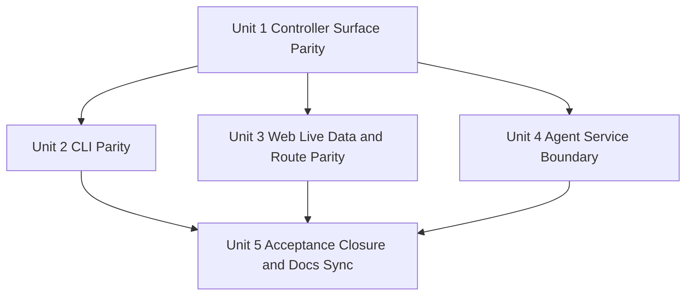

# PortManager Mainline Reconciliation Plan

## Overview

Close the gap between PortManager's frozen V1 contracts and the currently implemented branch slice without abandoning the reliability work already in place.
This plan assumes the 2026-04-16 docs truth-sync has landed and focuses on the executable work required to make Milestone 1 acceptance credible and to frame Milestone 2 accurately.

## Problem Frame

PortManager already proves backup, rollback, diagnostics, operations, drift visibility, and event history through controller, CLI, and milestone tests.
It still falls short of the broader V1 contract surface and product web information architecture described in the origin requirements document (see origin: `docs/brainstorms/2026-04-16-portmanager-mainline-progress-and-next-steps-requirements.md`).
If the project moves toward Milestone 3 or broader distributed architecture now, it will compound documentation drift and interface inconsistency instead of resolving them.

## Requirements Trace

- R1. Distinguish frozen baseline work from verified implementation work.
- R2. Make real controller, CLI, web, and agent capability boundaries explicit in shipped behavior.
- R3. Avoid claiming Milestone 1 or Milestone 2 acceptance before the missing surfaces are delivered.
- R4. Keep durable requirements and implementation guidance in repo.
- R5. Keep progress docs and roadmap surfaces synchronized as implementation lands.
- R6. Prioritize `hosts`, `bridge-rules`, `exposure-policies`, live web parity, and controller-agent steady-state integration before Milestone 3.
- R7. Preserve and extend the current reliability slice rather than discarding it.

## Scope Boundaries

- Do not redesign the V1 product boundary, milestone sequence, or `Toward C` strategy.
- Do not remove public resources from the contract because current code is missing them.
- Do not replace the current controller, CLI, or agent stacks with new languages or frameworks.

### Deferred to Separate Tasks

- Milestone 3 distributed-platform expansion: only after Milestone 1 acceptance closure and Milestone 2 acceptance evidence.
- Broad-platform support beyond the first Ubuntu 24.04 target: future iteration after controller-agent boundary is credible.

## Context & Research

### Relevant Code and Patterns

- `apps/controller/src/controller-server.ts` already shows the repository's current REST/SSE routing style, operation enqueueing, and async runner integration.
- `apps/controller/src/operation-store.ts` centralizes operation, backup, rollback-point, and diagnostics persistence patterns; new host/rule/policy surfaces should extend this store rather than fork parallel state paths.
- `crates/portmanager-cli/src/main.rs` already implements controller-backed read commands, `--json`, and wait-aware operation polling; new CLI surfaces should match this contract-first shape.
- `apps/web/src/main.ts` already holds the visual shell, typography, and evidence-heavy layout language; the next web phase should replace mock state and add routes without discarding the established shell.
- `crates/portmanager-agent/src/main.rs` already defines runtime-state, snapshot-manifest, and rollback-result file shapes; steady-state agent work should preserve these artifacts while adding network service behavior.
- Existing tests in `tests/controller/`, `tests/milestone/`, `tests/web/`, `crates/portmanager-cli/tests/`, and `crates/portmanager-agent/tests/` provide the verification style to extend.

### Institutional Learnings

- No repo-local `docs/solutions/` entries were present during this planning scan.

### External References

- None used. Current repo contracts and code patterns are sufficient to plan the next step.

## Key Technical Decisions

- Extend the existing controller store and runner instead of adding a second state-management path for hosts, rules, and policies.
- Add controller surface parity before deepening agent distribution work, because web and CLI cannot become truthful first-class peers without these resources.
- Replace web mock data incrementally: wire controller-backed reads and event streams first, then add missing pages and detail surfaces.
- Evolve the agent from CLI skeleton to steady-state service in-place, preserving current file artifact formats so diagnostics, snapshot, and rollback evidence stay compatible.
- Keep contract generation in the loop whenever public surfaces move, so docs, controller, CLI, and web stay aligned.

## Open Questions

### Resolved During Planning

- Should Milestone 3 work begin before interface parity closes? No. Interface parity and steady-state agent integration must land first.
- Should current reliability work be rolled back to reduce scope? No. It should be kept and used as the verified base for acceptance closure.

### Deferred to Implementation

- Whether host/rule/policy writes should land in one controller PR or a thin read-first slice followed by write operations.
- Whether the agent steady-state service should live in `crates/portmanager-agent/src/main.rs` initially or be split into a new `service` module once routing complexity appears.

## High-Level Technical Design

## Implementation Units

- [ ] **Unit 1: Controller Host, Rule, and Policy Surface Parity**

**Goal:** Implement the missing contract-backed controller resources so the repository serves real `hosts`, `bridge-rules`, and `exposure-policies` data and mutations instead of only operations/reliability slices.

**Requirements:** R2, R3, R6, R7

**Dependencies:** None

**Files:**
- Modify: `apps/controller/src/controller-server.ts`
- Modify: `apps/controller/src/operation-store.ts`
- Modify: `apps/controller/src/operation-runner.ts`
- Modify: `packages/contracts/openapi/openapi.yaml`
- Modify: `packages/typescript-contracts/src/generated/openapi.ts`
- Create: `tests/controller/host-rule-policy.test.ts`
- Modify: `tests/contracts/generate-contracts.test.mjs`

**Approach:**
- Add controller read and write paths for hosts, bridge rules, and exposure policies by extending the existing store and operation runner.
- Keep operation creation, rollback evidence, and degraded-state semantics consistent with current backup and diagnostics flows.
- Regenerate contract outputs whenever the public surface changes.

**Patterns to follow:**
- `apps/controller/src/controller-server.ts`
- `tests/controller/drift-reliability.test.ts`
- `tests/milestone/one-host-one-rule.test.ts`

**Test scenarios:**
- Happy path: create or update a host, bridge rule, and exposure policy through the controller and observe contract-aligned responses.
- Happy path: controller list/detail endpoints expose the same host/rule/policy state consumed later by CLI and web.
- Edge case: missing host or rule identifiers return explicit 404 or validation failures, not silent no-ops.
- Error path: destructive rule mutation still records backup and rollback evidence before state changes.
- Integration: drift-check, diagnostics, and rollback views stay consistent after new host/rule/policy state is introduced.

**Verification:**
- Controller test suite proves real host/rule/policy surface parity alongside existing reliability primitives.

- [ ] **Unit 2: CLI Public Surface Expansion**

**Goal:** Make the CLI a truthful peer to the controller for host, bridge-rule, and exposure-policy inspection and core write operations.

**Requirements:** R2, R3, R6, R7

**Dependencies:** Unit 1

**Files:**
- Modify: `crates/portmanager-cli/src/main.rs`
- Modify: `crates/portmanager-cli/tests/operation_get_cli.rs`
- Create: `crates/portmanager-cli/tests/host_rule_policy_cli.rs`

**Approach:**
- Extend the current `clap` command tree with host, bridge-rule, and exposure-policy subcommands that match controller resources and preserve `--json` behavior.
- Reuse the existing wait-aware operation polling path for write commands that enqueue work.

**Patterns to follow:**
- `crates/portmanager-cli/src/main.rs`
- `crates/portmanager-cli/tests/operation_get_cli.rs`

**Test scenarios:**
- Happy path: list and inspect hosts, rules, and policies in both text and JSON output.
- Happy path: write-oriented CLI commands surface accepted operation IDs and can optionally wait for terminal state.
- Edge case: missing or invalid controller responses produce structured JSON errors and clear text errors.
- Integration: CLI output stays consistent with controller detail payloads and operation replay URLs.

**Verification:**
- CLI tests prove contract-aligned read and write behavior for the missing public resources.

- [ ] **Unit 3: Web Live Data and Route Parity**

**Goal:** Replace mock-only web state with controller-backed data and add the missing navigation surfaces promised by the product information architecture.

**Requirements:** R1, R2, R3, R6, R7

**Dependencies:** Unit 1

**Files:**
- Modify: `apps/web/src/main.ts`
- Modify: `packages/typescript-contracts/src/index.ts`
- Modify: `tests/web/web-shell.test.ts`
- Modify: `tests/web/event-stream.test.ts`
- Create: `tests/web/live-controller-shell.test.ts`

**Approach:**
- Introduce controller fetch and event-stream consumption into the existing web shell without discarding the current design baseline.
- Add dedicated routes or view states for `Hosts`, `Bridge Rules`, `Backups`, `Console`, and diagnostics detail, while keeping overview, host detail, and operations evidence-heavy.
- Reuse generated contract types rather than parallel view-local schemas.

**Patterns to follow:**
- `apps/web/src/main.ts`
- `tests/web/web-shell.test.ts`
- `tests/controller/event-stream.test.ts`

**Test scenarios:**
- Happy path: overview and host detail render live controller-backed state instead of mock factories.
- Happy path: operations and console surfaces consume live event history and selected-operation replay streams.
- Edge case: degraded or partially missing data renders explicit empty states or warnings instead of disappearing panels.
- Integration: hosts, bridge rules, backups, and diagnostics detail stay semantically aligned with controller payloads.

**Verification:**
- Web tests prove live-data rendering and route parity across the locked V1 navigation model.

- [ ] **Unit 4: Agent Steady-State Service Boundary**

**Goal:** Move the agent from file-backed CLI skeleton toward the locked `HTTP over Tailscale` steady-state boundary without breaking existing artifact contracts.

**Requirements:** R2, R3, R6, R7

**Dependencies:** Unit 1

**Files:**
- Modify: `crates/portmanager-agent/src/main.rs`
- Modify: `crates/portmanager-agent/tests/agent_cli.rs`
- Create: `apps/controller/src/agent-client.ts`
- Modify: `apps/controller/src/controller-server.ts`
- Create: `tests/controller/agent-service.test.ts`

**Approach:**
- Preserve current runtime-state, snapshot, and rollback artifact formats, but add an agent service path that can serve steady-state execution over the locked controller-agent protocol.
- Keep bootstrap and rescue behavior separate from steady-state service semantics.
- Add a thin controller-side client or adapter so host and rule operations stop depending on purely local mock execution.

**Patterns to follow:**
- `crates/portmanager-agent/src/main.rs`
- `apps/controller/src/controller-server.ts`
- `crates/portmanager-agent/tests/agent_cli.rs`

**Test scenarios:**
- Happy path: controller reaches the agent through the steady-state service boundary for collect, apply, snapshot, and rollback operations.
- Edge case: agent unavailable or stale responses move affected resources into explicit degraded state.
- Error path: failed remote mutation preserves operation evidence and rollback eligibility.
- Integration: agent responses still emit artifacts compatible with existing diagnostics and backup/rollback consumers.

**Verification:**
- Controller and agent tests prove a minimal real controller-agent service path while retaining current artifact compatibility.

- [ ] **Unit 5: Acceptance Closure, Roadmap Sync, and Verification**

**Goal:** Re-run the full verification matrix, update progress documents, and move the repo to a truthful Milestone 1 / Milestone 2 status after code parity lands.

**Requirements:** R1, R3, R4, R5, R6

**Dependencies:** Units 2, 3, 4

**Files:**
- Modify: `README.md`
- Modify: `Interface Document.md`
- Modify: `TODO.md`
- Modify: `docs/specs/portmanager-milestones.md`
- Modify: `docs/specs/portmanager-v1-product-spec.md`
- Modify: `docs/specs/portmanager-ui-information-architecture.md`
- Modify: `docs-site/en/roadmap/milestones.md`
- Modify: `docs-site/zh/roadmap/milestones.md`
- Modify: `docs-site/data/roadmap.ts`
- Test: `tests/milestone/one-host-one-rule.test.ts`
- Test: `tests/milestone/reliability-backup-policy.test.ts`
- Test: `tests/milestone/reliability-drift.test.ts`
- Test: `tests/milestone/reliability-event-history.test.ts`
- Test: `tests/milestone/reliability-operations.test.ts`
- Test: `tests/milestone/reliability-recovery.test.ts`

**Approach:**
- Update progress language only after controller, CLI, web, and agent evidence is verified.
- Keep roadmap stages and statuses aligned with actual acceptance state instead of aspirational labels.
- Treat docs sync as a final acceptance activity, not a substitute for missing implementation work.

**Patterns to follow:**
- `README.md`
- `docs/specs/portmanager-milestones.md`
- `docs-site/data/roadmap.ts`

**Test scenarios:**
- Integration: Milestone 1 proof covers real host/rule readiness, backup-before-mutation, rollback evidence, diagnostics evidence, and cross-surface state parity.
- Integration: reliability tests still pass after host/rule/policy and live web work land.
- Error path: docs and roadmap statuses are not advanced when verification still shows acceptance gaps.

**Verification:**
- `pnpm test`, `pnpm typecheck`, `cargo test --workspace`, `corepack pnpm --dir docs-site run docs:build`, and `pnpm milestone:verify` all succeed before any status upgrade is declared.

## System-Wide Impact

- **Interaction graph:** Controller routes, operation store, CLI command tree, web render flow, and agent execution boundary all change together; contracts remain the shared seam.
- **Error propagation:** Controller validation and transport failures must propagate into explicit operation states and degraded signals instead of generic 500-style ambiguity.
- **State lifecycle risks:** Adding host/rule/policy persistence increases partial-write and evidence-link risks; backup and rollback association must stay atomic from the user's perspective.
- **API surface parity:** Every new controller surface must be mirrored into CLI and web consumption before milestone status changes.
- **Integration coverage:** Unit tests alone will not prove cross-surface parity; milestone verification and live web/controller integration tests remain required.
- **Unchanged invariants:** Docs-first governance, contract generation, controller-side diagnostics capture, mandatory local backup before destructive mutation, and `Toward C` gating all remain unchanged.

## Risks & Dependencies

| Risk | Mitigation |
|------|------------|
| Host/rule/policy surface expansion duplicates state logic outside `operation-store`. | Extend existing store and runner patterns; reject parallel in-memory models. |
| Web route expansion drifts from controller contracts and reintroduces mock-only behavior. | Consume generated contract types and back every new route with controller integration tests. |
| Agent service work destabilizes existing snapshot and rollback artifacts. | Preserve current artifact schemas and cover compatibility with controller and agent tests before flipping docs language. |
| Reliability slice gets blocked behind too much UI work. | Land controller and CLI parity first, then use those surfaces to drive web and agent work incrementally. |

## Documentation / Operational Notes

- Keep progress documents bilingual and preserve the existing `Updated` / `Version` metadata format.
- Merge work into local `main` only after verification passes and both the feature branch and source clone return to a clean working tree.

## Sources & References

- **Origin document:** `docs/brainstorms/2026-04-16-portmanager-mainline-progress-and-next-steps-requirements.md`
- Related code: `apps/controller/src/controller-server.ts`
- Related code: `crates/portmanager-cli/src/main.rs`
- Related code: `apps/web/src/main.ts`
- Related code: `crates/portmanager-agent/src/main.rs`
