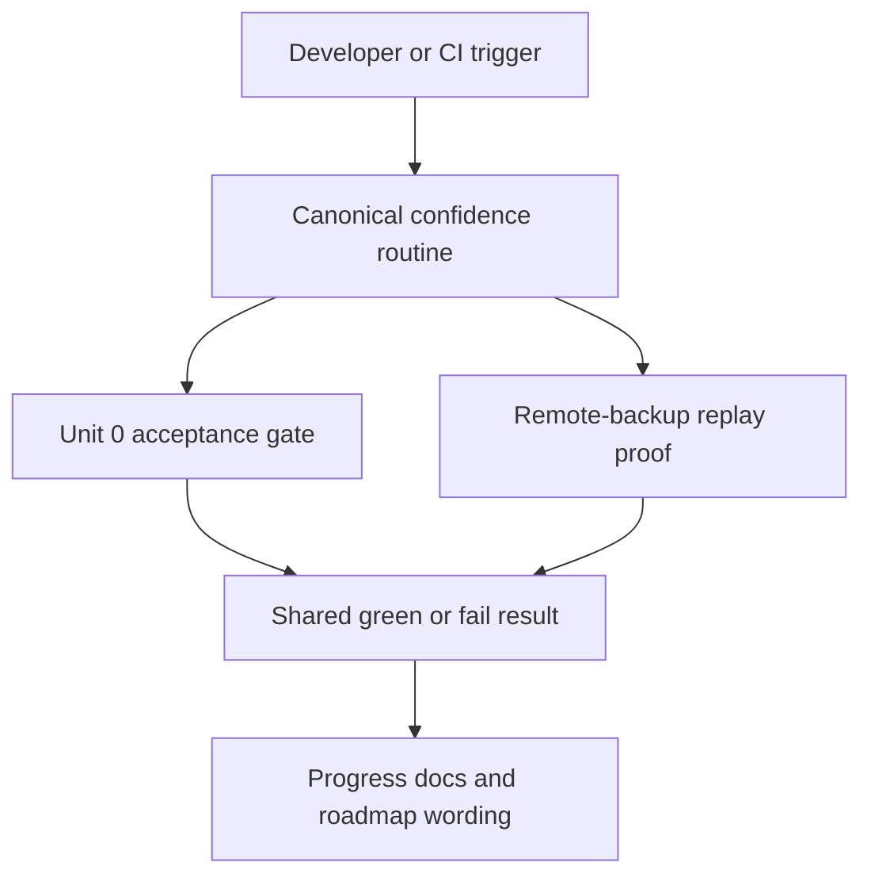

# PortManager Milestone 2 Confidence Routine Plan

Updated: 2026-04-17
Version: v0.2.1-completed

## Overview
This plan starts after the completed `2026-04-16` reconciliation program.
Its job is not to reopen Milestone 1 parity or invent a new runtime architecture.
Its job is to turn the already-shipped Milestone 2 evidence into one canonical confidence routine, wire that routine into mainline evidence collection, and keep docs aligned with the new narrower gap.

Status note: Units 6 through 8 are now completed in `main`.
Current remaining lane has narrowed further to empirical confidence-history accumulation on top of the shipped routine, because durable report, history, and summary artifacts with CI traceability metadata now exist alongside `push main` / `workflow_dispatch` / daily schedule evidence collection for developers and CI review.

## Problem Frame
PortManager now has an accepted live host / rule / policy slice plus real Milestone 2 reliability follow-through work on the same model.
The remaining gap is that current proof still depends on two entrypoints: `pnpm acceptance:verify` and `pnpm milestone:verify:reliability-remote-backup-replay`.
That split is manageable for a repo owner who already knows the story, but it is a weak foundation for repeatable Milestone 2 promotion discipline.

## Requirements Trace
- R1. Mark the `2026-04-16` reconciliation work as completed history and this plan as the active lane.
- R2. Describe the open Milestone 2 gap as proof orchestration and green-history accumulation.
- R3. Expose one canonical confidence routine that composes the standing acceptance gate with the replay proof while preserving milestone semantics.
- R4. Resolve where that routine lives locally and in CI.
- R5. Keep root docs and roadmap surfaces pointed at the same next lane and the same active direction docs.
- R6. Make remaining Milestone 2 evidence requirements explicit.

## Scope Boundaries
- Do not reopen host / bridge-rule / exposure-policy / Web parity work.
- Do not change the locked `HTTP over Tailscale` controller-agent boundary.
- Do not collapse Milestone 1 acceptance and Milestone 2 promotion into one vague “all green” story.
- Do not add new reliability features before the confidence routine itself is coherent.

## Context and Research

### Relevant Code and Patterns
- `scripts/acceptance/verify.mjs` already provides the repo’s ordered step-runner pattern for canonical verification commands.
- `package.json` already exposes both the standing acceptance gate and the separate remote-backup replay proof command.
- `scripts/milestone/verify-one-host-one-rule.ts` and `scripts/milestone/verify-reliability-remote-backup-replay.ts` already prove the accepted live slice at two different confidence depths; the next lane should compose them rather than rewrite them.
- `.github/workflows/mainline-acceptance.yml` is already the mainline verification baseline and should remain the pattern for CI wiring.
- `README.md`, `TODO.md`, `Interface Document.md`, `docs/specs/portmanager-milestones.md`, `docs/specs/portmanager-v1-product-spec.md`, and `docs-site/data/roadmap.ts` already act as the repo’s public progress surfaces and must continue to move together.

### Institutional Learnings
- No `docs/solutions/` entries exist for this repo, so the plan should stay close to current repo-local patterns instead of inventing new orchestration conventions.

### External References
- None needed. Current repo structure and proof scripts are sufficient for planning.

## Key Technical Decisions
- Introduce one explicit Milestone 2 confidence routine instead of relying on contributors to remember two separate commands.
- Keep `pnpm acceptance:verify` as the Unit 0 branch-discipline gate; the new routine should compose that gate rather than silently redefine it.
- Prefer reusing the existing step-runner structure in `scripts/acceptance/verify.mjs` so proof orchestration logic does not fork.
- Collect the heavier confidence routine on `main`, manual runs, and the daily schedule history path first; keep the default PR gate scoped to the standing acceptance discipline unless implementation evidence shows the extra replay cost is negligible enough to broaden later.

## Open Questions

### Resolved During Planning
- Should the next lane add more surface behavior? No. Proof orchestration is the actual remaining gap.
- Should the repo keep Milestone 1 and Milestone 2 semantics distinct? Yes. The new routine should clarify that distinction, not erase it.
- Should the next plan extend existing proof scripts rather than replace them? Yes. Composition is lower risk than reinvention.

### Resolved During Implementation
- Final command naming settled as `milestone:verify:confidence`.
- CI now runs the heavier routine on `push main`, `workflow_dispatch`, and the daily `schedule` path while PRs keep the lighter acceptance gate, and the confidence workflow now restores/saves the history bundle across runs.

## High-Level Technical Design

## Implementation Units

- [x] **Unit 6: Canonical Confidence Routine**

**Goal:** Introduce one developer-facing and automation-friendly command that composes the standing acceptance gate with the remote-backup replay proof.

**Requirements:** R2, R3, R4

**Dependencies:** None beyond the completed `2026-04-16` plan

**Files:**
- Modify: `package.json`
- Modify: `scripts/acceptance/verify.mjs`
- Create or modify: `scripts/acceptance/` confidence-runner entrypoint as needed
- Create: `tests/milestone/reliability-confidence-routine.test.mjs`

**Approach:**
- Reuse the existing ordered step-runner pattern so the new routine stays transparent and fail-fast.
- Keep the default acceptance path intact, then add an explicit composed routine for Milestone 2 confidence collection.
- Avoid duplicating the proof logic already living in the milestone scripts; this unit should orchestrate, not rewrite, those proofs.

**Patterns to follow:**
- `scripts/acceptance/verify.mjs`
- `scripts/milestone/verify-one-host-one-rule.ts`
- `scripts/milestone/verify-reliability-remote-backup-replay.ts`

**Test scenarios:**
- Happy path: the new confidence routine runs the existing acceptance sequence and the remote-backup replay proof in one ordered command.
- Happy path: the standing `pnpm acceptance:verify` behavior remains unchanged for Unit 0 branch discipline.
- Error path: replay failure causes the composed confidence routine to fail after the standing acceptance sequence succeeds.
- Error path: failure in the standing acceptance sequence prevents the replay proof from running and returns a non-zero exit code.

**Verification:**
- Run the new confidence routine locally.
- Re-run `pnpm acceptance:verify` to confirm Unit 0 semantics still hold.

- [x] **Unit 7: Mainline Evidence Wiring**

**Goal:** Collect the new confidence routine automatically on the branches or triggers that matter for Milestone 2 confidence history without turning every PR into a milestone-promotion event.

**Requirements:** R3, R4, R6

**Dependencies:** Unit 6

**Files:**
- Modify: `.github/workflows/mainline-acceptance.yml`
- Modify: `README.md`
- Modify: `TODO.md`

**Approach:**
- Keep the current acceptance job as the standing branch-discipline baseline.
- Add a clearly named confidence path for `main`, `workflow_dispatch`, and the daily `schedule` trigger so green history can accumulate without confusing PR validation with milestone promotion.
- Make trigger scope explicit in docs so contributors know when each routine should be used.

**Patterns to follow:**
- `.github/workflows/mainline-acceptance.yml`
- Existing `docs-pages` / `mainline-acceptance` workflow naming style

**Test scenarios:**
- Happy path: `main` runs or manual runs exercise the new confidence routine successfully.
- Happy path: PR validation still exercises the lighter Unit 0 gate unless the implementation explicitly broadens scope.
- Error path: confidence-path failures remain visible as Milestone 2 evidence failures rather than being mistaken for missing Milestone 1 parity.

**Verification:**
- Validate the workflow locally as far as practical by running the composed command.
- Confirm workflow YAML still preserves the existing acceptance path.

- [x] **Unit 8: Progress and Promotion Sync**

**Goal:** Update root docs, milestone/spec docs, roadmap data, and developer-progress wording so the repo’s narrative matches the new confidence routine and the closed `2026-04-16` history.

**Requirements:** R1, R2, R5, R6

**Dependencies:** Units 6 and 7

**Files:**
- Modify: `README.md`
- Modify: `TODO.md`
- Modify: `Interface Document.md`
- Modify: `docs/specs/portmanager-milestones.md`
- Modify: `docs/specs/portmanager-v1-product-spec.md`
- Modify: `docs-site/data/roadmap.ts`
- Regenerate: `docs-site/en/roadmap/milestones.md`
- Regenerate: `docs-site/zh/roadmap/milestones.md`

**Approach:**
- Explicitly record that the `2026-04-16` reconciliation plan is completed history and that the confidence-routine plan is now the live direction doc.
- Replace generic “repeat replay and acceptance” wording with the exact confidence-routine story once the command exists.
- Keep roadmap developer-progress and milestone pages aligned with root docs so there is still one truthful repo narrative.

**Patterns to follow:**
- Existing root progress-doc versioning and bilingual update structure
- `docs-site/data/roadmap.ts` as the single source for the public roadmap page

**Test scenarios:**
- Happy path: root docs and roadmap pages all point to the same active direction docs and the same confidence routine wording.
- Happy path: generated roadmap pages render the updated developer-progress text in both English and Chinese.
- Error path: no doc claims Milestone 2 acceptance before the composed confidence routine exists and starts collecting green history.

**Verification:**
- `corepack pnpm --dir docs-site --ignore-workspace run docs:generate`
- `pnpm test`
- `pnpm acceptance:verify`
- New confidence routine command from Unit 6

## Risks and Mitigations

| Risk | Mitigation |
| --- | --- |
| Confidence routine is mistaken for automatic Milestone 2 acceptance | Keep docs explicit that the routine earns history; it does not instantly close the milestone |
| Proof orchestration forks into multiple wrappers and drifts | Reuse the existing acceptance step-runner pattern and compose current proof scripts instead of cloning them |
| CI runtime expands too broadly too early | Keep trigger scope narrow at first and widen only if runtime cost stays acceptable |

## Verification Strategy
- First verify the new composed confidence command locally.
- Then verify `pnpm acceptance:verify` still behaves as the standing Unit 0 gate.
- Regenerate roadmap pages and re-run docs-aware verification before pushing progress wording.
- Only after those checks pass should the repo move its next-lane wording from “two commands” to “one confidence routine.”
