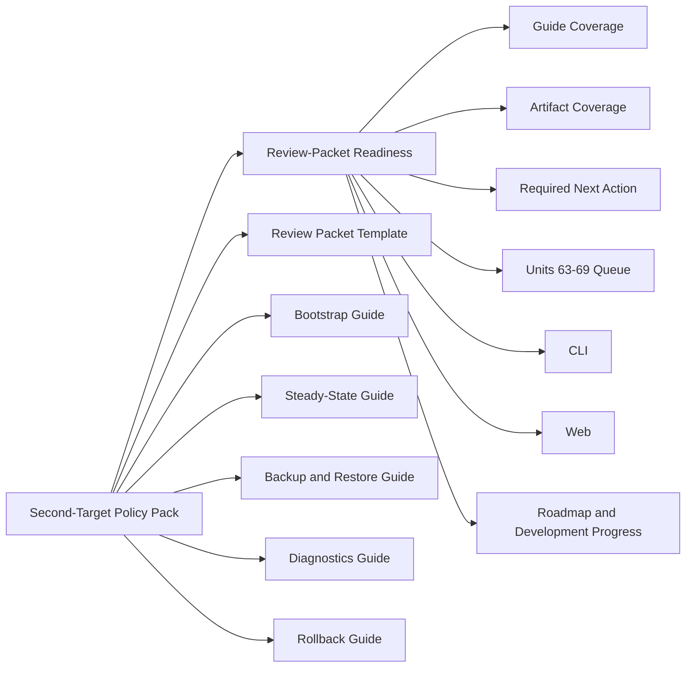

# PortManager Milestone 3 Review-Packet Readiness Plan

Updated: 2026-04-21
Version: v0.1.0

## Status Note
Late `2026-04-21` progress now moves this plan past initial readiness publication.
Units 63 through 65 are landed.
`/second-target-policy-pack` now reports guide coverage `6/6`, artifact coverage `8/20`, and landed bootstrap plus steady-state packet parity for declared candidate `debian-12-systemd-tailscale`.
One bounded Debian 12 review packet is preserved at `docs/operations/artifacts/debian-12-bootstrap-packet-2026-04-21/`.
The active remaining queue is now Units 66 through 69: backup-and-restore packet execution, diagnostics packet execution, rollback packet execution, and second-target review closeout.
The implementation units below stay preserved as the original execution map so developers can trace why the current remaining queue exists.

## Overview
This plan covers the post-guide Milestone 3 queue after Units 51 through 62 landed.
It treats the Debian 12 review-prep guide set as complete baseline.
It does not treat guide existence as parity proof.
The first implementation unit in this plan publishes readiness truth and the next bounded queue so developers can see exactly what remains before second-target review can open.

## Problem Frame
The repo no longer lacks review-prep governance docs.
It no longer lacks the review-packet template or the five proof guides.
It now lacks one explicit readiness layer that says:

- guide set is complete
- execution artifact coverage is still missing
- Unit 63 through Unit 69 are the next bounded steps
- support claims stay locked until packet execution and closeout are real

Without that layer, public docs drift toward an outdated story where the next job is still “write the guides,” even though those files already landed.

## Requirements Trace
- R1-R3. Publish post-guide Milestone 3 truth while preserving the Milestone 2 guardrail bundle.
- R4-R7. Extend `/second-target-policy-pack` with readiness state and coverage truth across controller, generated contracts, CLI, web, and docs.
- R8-R10. Publish the next bounded Unit 63 through Unit 69 queue and lock the wording through regression tests.

## Current Architecture Deep Compare

| Concern | Current verified base | Next move |
| --- | --- | --- |
| Second-target claim posture | `/second-target-policy-pack` already holds support on Ubuntu while Debian 12 stays review-prep only | Add readiness and coverage truth without weakening the hold posture |
| Guide-set governance | Review contract, acceptance recipe, ownership note, review-packet template, and five proof guides already exist | Stop describing those files as missing work and move docs to execution readiness |
| Candidate-host execution | Create/probe/bootstrap review-prep lane already exists | Publish that the lane is real but packet artifact capture is still missing |
| Developer progress visibility | Roadmap and development-progress pages already show Milestone 3 entry and review-pack CI coverage | Retarget them to the post-guide unit map and readiness truth |

## Key Technical Decisions
- Reuse `/second-target-policy-pack` as the canonical post-guide truth surface instead of adding a new controller route.
- Model guide coverage and artifact coverage separately so “docs landed” cannot masquerade as “packet executed.”
- Publish a fixed Unit 63 through Unit 69 queue inside the readiness surface so CLI, web, and docs share the same next-unit map.
- Keep Unit 63 scoped to truth-publishing only; do not fake packet execution inside this implementation slice.

## High-Level Technical Design

## Implementation Units

- [x] **Unit 63: Review-Packet Readiness Pack**

**Goal:** Publish one explicit post-guide readiness surface that tells developers the guide set is complete, the execution artifact bundle is still missing, and Units 64 through 69 are the next bounded queue.

**Requirements:** R1-R10

**Dependencies:** Units 58-62

**Files:**
- Modify: `apps/controller/src/second-target-policy-pack.ts`
- Modify: `packages/contracts/openapi/openapi.yaml`
- Modify: `packages/typescript-contracts/src/generated/*`
- Modify: `crates/portmanager-cli/src/main.rs`
- Modify: `apps/web/src/main.ts`
- Modify: `README.md`
- Modify: `TODO.md`
- Modify: `Interface Document.md`
- Modify: `docs/specs/portmanager-milestones.md`
- Modify: `docs/specs/portmanager-v1-product-spec.md`
- Modify: `docs/specs/portmanager-toward-c-strategy.md`
- Modify: `docs/architecture/portmanager-v1-architecture.md`
- Modify: `docs-site/data/roadmap.ts`
- Modify: `docs-site/.vitepress/theme/components/MilestoneConfidencePage.vue`
- Modify: `docs-site/.vitepress/theme/components/RoadmapPage.vue`
- Create: `docs/brainstorms/2026-04-21-portmanager-m3-review-packet-readiness-requirements.md`
- Create: `docs/plans/2026-04-21-portmanager-m3-review-packet-readiness-plan.md`
- Modify: `tests/controller/second-target-policy-pack.test.ts`
- Modify: `crates/portmanager-cli/tests/operation_get_cli.rs`
- Modify: `tests/web/web-shell.test.ts`
- Modify: `tests/contracts/generate-contracts.test.mjs`
- Modify: `tests/docs/development-progress.test.mjs`

**Approach:**
- Extend `SecondTargetPolicyPack` with a `reviewPacketReadiness` object that publishes readiness state, guide coverage, artifact coverage, required next action, and the next bounded unit map.
- Default the landed repo truth to guide coverage complete and artifact coverage empty until a real Debian 12 packet is captured.
- Surface the same readiness object in controller, generated contracts, CLI text output, web cards, roadmap data, and development-progress copy.
- Update public docs so the active implementation map points at the new requirements/plan pair and states that Units 51 through 63 are landed while Units 64 through 69 remain queued.

**Patterns to follow:**
- `apps/controller/src/persistence-decision-pack.ts`
- `apps/controller/src/consumer-boundary-decision-pack.ts`
- `apps/controller/src/deployment-boundary-decision-pack.ts`
- `apps/controller/src/second-target-policy-pack.ts`
- `tests/controller/second-target-policy-pack.test.ts`
- `tests/docs/development-progress.test.mjs`

**Test scenarios:**
- Happy path: default second-target policy pack reports guide coverage `6/6`, artifact coverage `0/20`, readiness state `capture_required`, and Unit 63 through Unit 69 queue.
- Happy path: partial artifact capture changes readiness state to `capture_in_progress` without changing second-target support claims.
- Happy path: controller, CLI, and Web all surface the same readiness block and unit map.
- Regression: existing second-target decision state and hold posture remain unchanged.
- Regression: roadmap and development-progress pages point at the new requirements/plan pair and the post-guide wording stays locked.

- [x] **Unit 64: Bootstrap Packet Execution**

**Goal:** Preserve one Debian 12 bootstrap execution bundle inside the review packet without changing support claims yet.

**Requirements:** R4-R9

**Dependencies:** Unit 63

**Files:**
- Modify: `docs/operations/portmanager-debian-12-review-packet-template.md`
- Modify: `docs/operations/portmanager-debian-12-bootstrap-proof-capture.md`
- Modify: `docs/operations/portmanager-debian-12-acceptance-recipe.md`
- Modify: `apps/controller/src/second-target-policy-pack.ts`
- Modify: `docs/specs/portmanager-milestones.md`

**Approach:**
- Capture one bounded bootstrap operation id, result summary, audit linkage, and target-profile confirmation.
- Move only the bootstrap-related artifact coverage entries; keep other parity criteria unchanged.

**Test scenarios:**
- Happy path: readiness surface shows bootstrap artifacts captured while other capture slots remain missing.
- Regression: second-target decision state stays on hold until the rest of the packet is real.

- [x] **Unit 65: Steady-State Packet Execution**

**Goal:** Add steady-state `/health` and `/runtime-state` evidence to the same Debian 12 packet.

**Requirements:** R4-R9

**Dependencies:** Unit 64

**Files:**
- Modify: `docs/operations/portmanager-debian-12-review-packet-template.md`
- Modify: `docs/operations/portmanager-debian-12-steady-state-proof-capture.md`
- Modify: `docs/operations/portmanager-debian-12-acceptance-recipe.md`
- Modify: `apps/controller/src/second-target-policy-pack.ts`
- Modify: `docs/specs/portmanager-milestones.md`

**Approach:**
- Capture one post-bootstrap controller mutation and the linked steady-state runtime bundle.
- Keep the same packet id and candidate host identity.

**Test scenarios:**
- Happy path: readiness surface shows the steady-state artifacts captured alongside bootstrap artifacts.
- Regression: no wider support claim changes until the full packet exists.

- [ ] **Unit 66: Backup-And-Restore Packet Execution**

**Goal:** Add backup-bearing mutation, manifest lineage, remote-backup result, and restore-readiness linkage to the same packet.

**Requirements:** R4-R9

**Dependencies:** Unit 65

**Files:**
- Modify: `docs/operations/portmanager-debian-12-review-packet-template.md`
- Modify: `docs/operations/portmanager-debian-12-backup-restore-proof-capture.md`
- Modify: `docs/operations/portmanager-debian-12-acceptance-recipe.md`
- Modify: `apps/controller/src/second-target-policy-pack.ts`
- Modify: `docs/specs/portmanager-milestones.md`

**Approach:**
- Preserve backup and restore evidence on the same bounded packet instead of opening a second evidence path.

**Test scenarios:**
- Happy path: readiness surface advances artifact coverage for backup-and-restore slots.
- Regression: packet still stays incomplete until diagnostics and rollback artifacts are present.

- [ ] **Unit 67: Diagnostics Packet Execution**

**Goal:** Add diagnostics artifact paths, controller event linkage, and operator drift note to the same packet.

**Requirements:** R4-R9

**Dependencies:** Unit 66

**Files:**
- Modify: `docs/operations/portmanager-debian-12-review-packet-template.md`
- Modify: `docs/operations/portmanager-debian-12-diagnostics-proof-capture.md`
- Modify: `docs/operations/portmanager-debian-12-acceptance-recipe.md`
- Modify: `apps/controller/src/second-target-policy-pack.ts`
- Modify: `docs/specs/portmanager-milestones.md`

**Approach:**
- Capture diagnostics evidence in the same packet so drift notes stay tied to controller truth.

**Test scenarios:**
- Happy path: diagnostics artifact coverage becomes explicit in `/second-target-policy-pack`.
- Regression: no wording widens while rollback evidence remains missing.

- [ ] **Unit 68: Rollback Packet Execution**

**Goal:** Add rollback rehearsal evidence and post-rollback diagnostics linkage to complete the bounded Debian 12 packet.

**Requirements:** R4-R9

**Dependencies:** Unit 67

**Files:**
- Modify: `docs/operations/portmanager-debian-12-review-packet-template.md`
- Modify: `docs/operations/portmanager-debian-12-rollback-proof-capture.md`
- Modify: `docs/operations/portmanager-debian-12-acceptance-recipe.md`
- Modify: `apps/controller/src/second-target-policy-pack.ts`
- Modify: `docs/specs/portmanager-milestones.md`

**Approach:**
- Preserve rollback-point id, rollback result summary, and post-rollback diagnostics linkage inside the same review packet.

**Test scenarios:**
- Happy path: readiness surface reaches `packet_ready` after rollback evidence completes the full artifact set.
- Regression: support claim still does not move until closeout review confirms the packet.

- [ ] **Unit 69: Second-Target Review Closeout**

**Goal:** Open the bounded second-target review only after the full packet exists and all public docs still match the hold-or-review truth.

**Requirements:** R1-R10

**Dependencies:** Unit 68

**Files:**
- Modify: `apps/controller/src/second-target-policy-pack.ts`
- Modify: `README.md`
- Modify: `TODO.md`
- Modify: `Interface Document.md`
- Modify: `docs/specs/portmanager-milestones.md`
- Modify: `docs/specs/portmanager-v1-product-spec.md`
- Modify: `docs/specs/portmanager-toward-c-strategy.md`
- Modify: `docs/architecture/portmanager-v1-architecture.md`
- Modify: `docs-site/data/roadmap.ts`
- Modify: `docs-site/.vitepress/theme/components/MilestoneConfidencePage.vue`
- Modify: `docs-site/.vitepress/theme/components/RoadmapPage.vue`

**Approach:**
- Re-read the complete Debian 12 packet, then update `/second-target-policy-pack` and public docs only if every criterion remains justified.
- Keep support claims locked if any packet artifact regresses or becomes stale.

**Test scenarios:**
- Happy path: public docs move from `capture_required` or `capture_in_progress` to review-ready wording without claiming supported-target expansion yet.
- Regression: any missing artifact or wording drift keeps the candidate on hold.

## Verification Strategy
- `node --experimental-strip-types --test tests/controller/second-target-policy-pack.test.ts tests/web/web-shell.test.ts`
- `cargo test operations_second_target_policy_pack --manifest-path Cargo.toml`
- `node --experimental-strip-types --test tests/contracts/generate-contracts.test.mjs tests/docs/development-progress.test.mjs`
- `pnpm contracts:generate`
- `corepack pnpm --dir docs-site --ignore-workspace run docs:generate`
- `git diff --check`

## Risks And Mitigations

| Risk | Mitigation |
| --- | --- |
| Public docs keep talking about guide landing after the guide set already exists | Point roadmap and development-progress pages at Unit 63 and the new requirements/plan pair |
| Developers mistake docs presence for parity proof | Publish artifact coverage separately from guide coverage |
| The next queue becomes hand-wavy prose again | Freeze Unit 63 through Unit 69 as explicit readiness data inside `/second-target-policy-pack` |
| Future packet execution widens support claims too early | Keep second-target decision state independent from readiness visibility and move claims only after closeout review |
