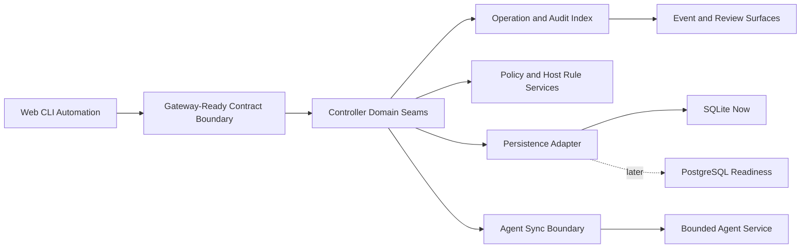

# PortManager Milestone 3 Toward C Enablement Plan

Updated: 2026-04-21
Version: v0.1.0

## Overview
This plan opens Milestone 3 as a bounded `Phase 0 enablement` lane.
It does not treat `Toward C` as already delivered.
It uses the accepted Milestone 1 slice and the promotion-ready Milestone 2 guardrail as the verified base, then defines the first concrete workstreams needed before PortManager can truthfully claim any stronger distributed-platform shape.

## Problem Frame
The repo no longer lacks Milestone 2 review machinery.
It now lacks a concrete next-phase architecture path.

Deep comparison against the current codebase shows:

- `apps/controller/src/controller-server.ts` still concentrates transport handling, orchestration, and much of the domain wiring
- `apps/controller/src/operation-store.ts` still centralizes persistence, host/rule/policy state, event-adjacent records, and heartbeat indexing behind one SQLite-backed store
- `apps/web/src/main.ts` and `crates/portmanager-cli/src/main.rs` still consume the controller directly instead of a gateway boundary
- `crates/portmanager-agent/src/main.rs` already proves a bounded remote execution plane, but not richer event semantics or orchestration contracts
- `scripts/acceptance/verify.mjs`, `scripts/acceptance/verify-confidence.mjs`, and the milestone tests already protect one trusted evidence model that Milestone 3 must not bypass

Without a concrete Milestone 3 plan, the roadmap can drift in two bad directions:

- stay artificially frozen in Milestone 2 wording maintenance even though the entry gate is now credible
- overclaim full Scheme C readiness even though the code still lacks its key architecture seams

## Requirements Trace
- R1-R3. Open Milestone 3 as Phase 0 enablement while preserving the Milestone 2 guardrail.
- R4-R7. Define bounded workstreams for gateway-ready boundaries, controller seams, event/audit indexing, batch orchestration, and persistence readiness.
- R8-R10. Sync repo docs, roadmap pages, and regression coverage around the same evidence-first Milestone 3 posture.

## Current Architecture Deep Compare

| Concern | Current verified base | Milestone 3 Phase 0 move |
| --- | --- | --- |
| Consumer entry boundary | Web and CLI call controller `REST + SSE` directly | Define a gateway-ready contract boundary without adding a fake extra service yet |
| Domain separation | Controller server and store still carry most policy, event, audit, and orchestration wiring | Extract explicit controller-domain seams first, then decide whether deployment split is justified |
| Agent role | Agent already serves health, runtime, apply, snapshot, and rollback with bounded semantics | Deepen evidence/event reporting without turning the agent into a strategy peer |
| Orchestration breadth | Proof slice remains one host / one rule plus reliability replay | Add bounded multi-host and batch-operation primitives on the same audit/evidence model |
| Persistence path | SQLite is still the only real store | Introduce persistence seams and migration-readiness checks before any PostgreSQL promise |
| Platform expansion | Only Ubuntu 24.04 target is credible | Define explicit target-abstraction rules before second-target work starts |

## Key Technical Decisions
- Keep Milestone 2 review helpers and confidence artifacts as mandatory guardrails while Milestone 3 begins; no new phase gets to bypass `pnpm acceptance:verify`, `pnpm milestone:verify:confidence`, or the wording-review flow.
- Start with seam extraction inside the current controller instead of adding deployment topology first. The architecture problem is not “missing microservices”; it is missing explicit boundaries.
- Treat an API gateway as a contract and routing boundary goal, not an immediate new binary or deployment requirement.
- Introduce multi-host and batch orchestration only through auditable operation envelopes that reuse the existing evidence model.
- Keep PostgreSQL as a readiness target behind persistence seams, not as an immediate default-store migration.

## High-Level Technical Design

## Implementation Units

- [x] **Unit 50: Milestone 3 Entry Docs And Roadmap Realignment**

**Goal:** Land the requirements, plan, and progress-doc wording that move Milestone 3 from a distant slogan to a bounded next phase.

**Requirements:** R1-R3, R8-R10

**Dependencies:** None

**Files:**
- Create: `docs/brainstorms/2026-04-21-portmanager-m3-toward-c-enablement-requirements.md`
- Create: `docs/plans/2026-04-21-portmanager-m3-toward-c-enablement-plan.md`
- Modify: `README.md`
- Modify: `TODO.md`
- Modify: `Interface Document.md`
- Modify: `docs/specs/portmanager-milestones.md`
- Modify: `docs/specs/portmanager-v1-product-spec.md`
- Modify: `docs/specs/portmanager-toward-c-strategy.md`
- Modify: `docs/architecture/portmanager-v1-architecture.md`
- Modify: `docs-site/data/roadmap.ts`
- Modify: `docs-site/.vitepress/theme/components/MilestoneConfidencePage.vue`
- Modify: `docs-site/.vitepress/theme/components/RoadmapPage.vue`
- Modify: `tests/docs/development-progress.test.mjs`

**Approach:**
- Retarget current-direction copy from Milestone 2 maintenance-only language to Milestone 3 Phase 0 enablement plus Milestone 2 guardrail maintenance.
- Publish the deep-compare gap map so roadmap pages show both progress and missing seams.
- Keep public pages honest by linking directly to the new requirements/plan pair and preserving the existing review helper guidance.

- [x] **Unit 51: Controller Domain Seam Extraction Baseline**

**Goal:** Separate controller transport wiring from host/rule/policy/orchestration logic so later gateway and service-boundary work grows from explicit seams.

**Requirements:** R4-R6

**Dependencies:** Unit 50

**Files:**
- Modify: `apps/controller/src/controller-server.ts`
- Modify: `apps/controller/src/operation-store.ts`
- Modify: `apps/controller/src/operation-runner.ts`
- Create: `apps/controller/src/controller-domain-service.ts`
- Create: `apps/controller/src/controller-read-model.ts`
- Create: `tests/controller/controller-domain-service.test.ts`

**Approach:**
- Pull host/rule/policy orchestration and read-model composition into explicit controller-domain modules.
- Leave external routes unchanged at first; Phase 0 needs seams, not new public surface claims.
- Keep the existing controller-backed evidence model and milestone tests intact while the seam extraction lands.

**Patterns to follow:**
- `apps/controller/src/controller-server.ts`
- `apps/controller/src/operation-store.ts`
- `tests/controller/host-rule-policy.test.ts`
- `tests/controller/agent-service.test.ts`

**Test scenarios:**
- Happy path: extracted domain service still powers host, rule, and policy reads with unchanged contract payloads.
- Happy path: bootstrap, apply, diagnostics, and rollback flows keep emitting the same operation and health evidence.
- Error path: unreachable-agent degradation still stays explicit after seam extraction.
- Regression: event replay, diagnostics filtering, and backup-aware destructive mutation remain intact.

- [ ] **Unit 52: Gateway-Ready Consumer Boundary And Batch Operation Envelope**

**Goal:** Introduce one contract-first boundary that can later sit behind an API gateway and one auditable batch-operation envelope for multi-host work without claiming full fleet management yet.

**Requirements:** R4-R7

**Dependencies:** Unit 51

**Files:**
- Modify: `packages/contracts/openapi/openapi.yaml`
- Modify: `packages/contracts/jsonschema/*.schema.json`
- Modify: `packages/typescript-contracts/src/generated/*`
- Modify: `apps/controller/src/controller-server.ts`
- Modify: `crates/portmanager-cli/src/main.rs`
- Modify: `apps/web/src/main.ts`
- Create: `tests/controller/batch-operations.test.ts`
- Create: `crates/portmanager-cli/tests/batch_operations_cli.rs`
- Modify: `tests/web/live-controller-shell.test.ts`

**Approach:**
- Add a bounded multi-host batch-operation envelope that reuses the existing operation/audit model instead of inventing a parallel orchestration path.
- Keep Web and CLI consuming the same controller-backed contract while shaping the transport boundary so a later gateway can proxy it cleanly.
- Do not broaden supported target claims in the same unit.

**Patterns to follow:**
- `packages/contracts/openapi/openapi.yaml`
- `crates/portmanager-cli/tests/host_rule_policy_cli.rs`
- `tests/controller/operation-runner.test.ts`

**Test scenarios:**
- Happy path: batch operation creates one auditable parent operation and host-scoped child evidence.
- Happy path: CLI and Web read the same batch status and per-host outcomes.
- Edge case: one failed host keeps partial degradation explicit without hiding successful hosts.
- Regression: existing single-host flows still behave unchanged.

- [ ] **Unit 53: Event And Audit Indexing Surface**

**Goal:** Turn the current event stream and review artifacts into a stronger indexed surface that can later support gateway consumers and broader orchestration without raw-log archaeology.

**Requirements:** R4-R6

**Dependencies:** Unit 51

**Files:**
- Modify: `apps/controller/src/controller-events.ts`
- Modify: `apps/controller/src/controller-server.ts`
- Modify: `apps/web/src/main.ts`
- Create: `apps/controller/src/event-audit-index.ts`
- Create: `tests/controller/event-audit-index.test.ts`
- Modify: `tests/web/live-controller-shell.test.ts`

**Approach:**
- Add explicit indexed read models for operation/event/audit review instead of keeping everything as replay-only transport output.
- Reuse the current milestone-confidence and review-pack posture as the documentation model for what “indexed review” means.
- Keep CLI/Web/API semantic parity while adding stronger query structure.

**Patterns to follow:**
- `apps/controller/src/controller-events.ts`
- `tests/controller/event-stream.test.ts`
- `tests/milestone/reliability-event-history.test.ts`

**Test scenarios:**
- Happy path: indexed event/audit queries return stable ordering and operation linkage.
- Happy path: web console and operation views read the same indexed structure.
- Edge case: degraded operations preserve linked evidence and event ordering.
- Regression: existing replay URLs still work.

- [ ] **Unit 54: Persistence Adapter And PostgreSQL Readiness Gate**

**Goal:** Make storage pressure measurable and migration-ready without promising PostgreSQL as the default store yet.

**Requirements:** R4-R7

**Dependencies:** Unit 51

**Files:**
- Modify: `apps/controller/src/operation-store.ts`
- Create: `apps/controller/src/persistence-adapter.ts`
- Create: `tests/controller/persistence-adapter.test.ts`
- Modify: `docs/specs/portmanager-milestones.md`
- Modify: `docs/specs/portmanager-toward-c-strategy.md`

**Approach:**
- Pull persistence behind an adapter boundary that preserves current SQLite behavior.
- Add explicit readiness checks and migration criteria instead of speculative database churn.
- Keep milestone docs aligned with measurable pressure rather than symbolic PostgreSQL ambition.

**Patterns to follow:**
- `apps/controller/src/operation-store.ts`
- `tests/controller/*.test.ts`

**Test scenarios:**
- Happy path: SQLite-backed behavior remains unchanged behind the adapter seam.
- Edge case: missing or invalid persistence configuration fails clearly.
- Regression: host/rule/policy, diagnostics, backup, rollback, and confidence flows still pass on SQLite.

## Verification Strategy
- `pnpm exec node --experimental-strip-types --test tests/docs/*.test.mjs`
- `corepack pnpm --dir docs-site --ignore-workspace run docs:generate`
- `corepack pnpm --dir docs-site --ignore-workspace run docs:build`
- `corepack pnpm acceptance:verify`
- `git diff --check`

## Risks And Mitigations

| Risk | Mitigation |
| --- | --- |
| Milestone 3 copy overclaims distributed delivery | Keep a verified-now vs blocking-gap map on roadmap, strategy, and architecture surfaces |
| Milestone 3 work weakens the Milestone 2 guardrail | Keep `pnpm acceptance:verify`, `pnpm milestone:verify:confidence`, and wording-review guidance visible in docs and tests |
| Gateway talk becomes premature topology churn | Start with contract and seam extraction before adding another deployable service |
| Batch orchestration bypasses evidence rules | Require every Phase 0 batch move to reuse the existing operation/audit model |
