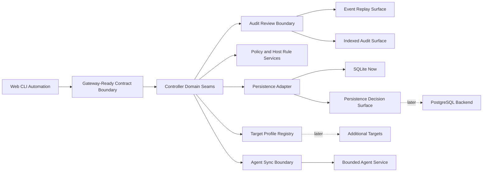

# PortManager Milestone 3 Toward C Enablement Plan

Updated: 2026-04-21
Version: v0.2.0

## Overview
This plan keeps Milestone 3 as a bounded `Phase 0 enablement` lane after Units 50 through 56 have already landed.
It does not treat `Toward C` as already delivered.
It uses the accepted Milestone 1 slice and the promotion-ready Milestone 2 guardrail as the verified base, then defines the next concrete workstreams needed before PortManager can truthfully claim any stronger distributed-platform shape.

## Problem Frame
The repo no longer lacks Milestone 2 review machinery.
It no longer lacks the first Milestone 3 seams either.
It now lacks the next boundary-decision layer that turns those seams into credible future split criteria.

Deep comparison against the current codebase shows:

- `apps/controller/src/controller-server.ts` still concentrates transport handling, orchestration, and much of the domain wiring
- `apps/controller/src/operation-store.ts` still centralizes persistence, host/rule/policy state, event-adjacent records, and heartbeat indexing even though it now sits behind a persistence adapter
- `apps/web/src/main.ts` and `crates/portmanager-cli/src/main.rs` now consume the shared `/api/controller` consumer boundary, but that boundary still lives inside the controller process
- `apps/controller/src/event-audit-index.ts` and `apps/controller/src/controller-events.ts` now expose review and replay surfaces, but no explicit audit-review boundary owns them yet
- `crates/portmanager-agent/src/main.rs` already proves a bounded remote execution plane, but not richer event semantics or orchestration contracts
- `apps/controller/src/persistence-adapter.ts` now measures PostgreSQL readiness pressure, but no explicit migration decision surface tells developers when cutover review must start
- the locked Ubuntu 24.04 + systemd + Tailscale target still exists mostly as scattered assumptions rather than one explicit target-profile registry
- `scripts/acceptance/verify.mjs`, `scripts/acceptance/verify-confidence.mjs`, and the milestone tests already protect one trusted evidence model that Milestone 3 must not bypass

Without a concrete Milestone 3 plan, the roadmap can drift in two bad directions:

- stay artificially frozen in Milestone 2 wording maintenance even though the entry gate is now credible
- overclaim full Scheme C readiness even though the code still lacks its next key boundary decisions and abstraction rules

## Requirements Trace
- R1-R3. Open Milestone 3 as Phase 0 enablement while preserving the Milestone 2 guardrail.
- R4-R7. Define bounded continuation workstreams for standalone audit/event boundary decisions, consumer-boundary split criteria, persistence migration criteria, and target abstraction.
- R8-R10. Sync repo docs, roadmap pages, and regression coverage around the same evidence-first Milestone 3 posture.

## Current Architecture Deep Compare

| Concern | Current verified base | Milestone 3 continuation move |
| --- | --- | --- |
| Consumer entry boundary | Web and CLI now use `/api/controller`, but the boundary still lives inside the controller process | Define split criteria and review ownership without inventing a fake gateway binary |
| Domain separation | Controller read/write seams plus indexed review are real, but transport and storage still centralize too much work | Extract an explicit audit-review service boundary before debating deployable topology |
| Agent role | Agent already serves health, runtime, apply, snapshot, and rollback with bounded semantics | Deepen evidence/reporting without turning the agent into a strategy peer |
| Orchestration breadth | One bounded batch exposure-policy envelope is real with parent/child outcomes | Reuse that audited envelope while deciding what wider multi-host operations may exist next |
| Persistence path | SQLite-backed persistence adapter and readiness metrics are real, but PostgreSQL is still disabled | Promote readiness metrics into a decision surface before any backend promise |
| Platform expansion | Only Ubuntu 24.04 + systemd + Tailscale is credible and mostly implicit | Introduce explicit target-profile rules before second-target work starts |

## Key Technical Decisions
- Keep Milestone 2 review helpers and confidence artifacts as mandatory guardrails while Milestone 3 begins; no new phase gets to bypass `pnpm acceptance:verify`, `pnpm milestone:verify:confidence`, or the wording-review flow.
- Treat Units 51 through 56 as landed baselines. The plan does not reopen consumer-boundary routing, indexed review publishing, or persistence seams unless regressions are found.
- Start the next phase with boundary ownership and abstraction rules inside the current controller instead of adding deployment topology first. The architecture problem is not “missing microservices”; it is missing explicit decision surfaces.
- Treat an API gateway as a contract and routing boundary goal, not an immediate new binary or deployment requirement.
- Introduce wider multi-host work only through auditable operation envelopes that reuse the existing evidence model.
- Keep PostgreSQL as a readiness target behind persistence seams, then add a decision surface before any default-store migration.
- Make the locked Ubuntu target explicit in code and contracts before discussing any second target.

## High-Level Technical Design

## Implementation Units

- [x] **Unit 50: Milestone 3 Entry Docs And Roadmap Realignment**

**Goal:** Land the requirements, plan, and progress-doc wording that move Milestone 3 from a distant slogan to a bounded next phase.

**Requirements:** R1-R3, R8-R10

**Dependencies:** None

**Files:**
- Create: `docs/brainstorms/2026-04-21-portmanager-m3-toward-c-enablement-requirements.md`
- Create: `docs/plans/2026-04-21-portmanager-m3-toward-c-enablement-plan.md`
- Modify: `README.md`
- Modify: `TODO.md`
- Modify: `Interface Document.md`
- Modify: `docs/specs/portmanager-milestones.md`
- Modify: `docs/specs/portmanager-v1-product-spec.md`
- Modify: `docs/specs/portmanager-toward-c-strategy.md`
- Modify: `docs/architecture/portmanager-v1-architecture.md`
- Modify: `docs-site/data/roadmap.ts`
- Modify: `docs-site/.vitepress/theme/components/MilestoneConfidencePage.vue`
- Modify: `docs-site/.vitepress/theme/components/RoadmapPage.vue`
- Modify: `tests/docs/development-progress.test.mjs`

**Approach:**
- Retarget current-direction copy from Milestone 2 maintenance-only language to Milestone 3 Phase 0 enablement plus Milestone 2 guardrail maintenance.
- Publish the deep-compare gap map so roadmap pages show both progress and missing seams.
- Keep public pages honest by linking directly to the new requirements/plan pair and preserving the existing review helper guidance.

- [x] **Unit 51: Controller Domain Seam Extraction Baseline**

**Goal:** Separate controller transport wiring from host/rule/policy/orchestration logic so later gateway and service-boundary work grows from explicit seams.

**Requirements:** R4-R6

**Dependencies:** Unit 50

**Files:**
- Modify: `apps/controller/src/controller-server.ts`
- Modify: `apps/controller/src/operation-store.ts`
- Modify: `apps/controller/src/operation-runner.ts`
- Create: `apps/controller/src/controller-domain-service.ts`
- Create: `apps/controller/src/controller-read-model.ts`
- Create: `tests/controller/controller-domain-service.test.ts`

**Approach:**
- Pull host/rule/policy orchestration and read-model composition into explicit controller-domain modules.
- Leave external routes unchanged at first; Phase 0 needs seams, not new public surface claims.
- Keep the existing controller-backed evidence model and milestone tests intact while the seam extraction lands.

**Patterns to follow:**
- `apps/controller/src/controller-server.ts`
- `apps/controller/src/operation-store.ts`
- `tests/controller/host-rule-policy.test.ts`
- `tests/controller/agent-service.test.ts`

**Test scenarios:**
- Happy path: extracted domain service still powers host, rule, and policy reads with unchanged contract payloads.
- Happy path: bootstrap, apply, diagnostics, and rollback flows keep emitting the same operation and health evidence.
- Error path: unreachable-agent degradation still stays explicit after seam extraction.
- Regression: event replay, diagnostics filtering, and backup-aware destructive mutation remain intact.

- [x] **Unit 52: Gateway-Ready Consumer Boundary And Batch Operation Envelope**

**Goal:** Introduce one contract-first boundary that can later sit behind an API gateway and one auditable batch-operation envelope for multi-host work without claiming full fleet management yet.

**Requirements:** R4-R7

**Dependencies:** Unit 51

**Files:**
- Modify: `packages/contracts/openapi/openapi.yaml`
- Modify: `packages/typescript-contracts/src/generated/*`
- Modify: `apps/controller/src/controller-server.ts`
- Modify: `apps/controller/src/controller-domain-service.ts`
- Modify: `apps/controller/src/controller-read-model.ts`
- Modify: `apps/controller/src/operation-store.ts`
- Modify: `crates/portmanager-cli/src/main.rs`
- Modify: `apps/web/src/main.ts`
- Create: `tests/controller/batch-operations.test.ts`
- Create: `crates/portmanager-cli/tests/batch_operations_cli.rs`
- Modify: `tests/web/live-controller-shell.test.ts`

**Approach:**
- Add a bounded multi-host batch-operation envelope that reuses the existing operation/audit model instead of inventing a parallel orchestration path.
- Keep Web and CLI consuming the same controller-backed contract while shaping the transport boundary so a later gateway can proxy it cleanly.
- Do not broaden supported target claims in the same unit.

**Patterns to follow:**
- `packages/contracts/openapi/openapi.yaml`
- `crates/portmanager-cli/tests/host_rule_policy_cli.rs`
- `tests/controller/operation-runner.test.ts`

**Test scenarios:**
- Happy path: batch operation creates one auditable parent operation and host-scoped child evidence.
- Happy path: CLI and Web read the same batch status and per-host outcomes.
- Edge case: one failed host keeps partial degradation explicit without hiding successful hosts.
- Regression: existing single-host flows still behave unchanged.

- [x] **Unit 53: Event And Audit Indexing Surface**

**Goal:** Turn the current event stream and review artifacts into a stronger indexed surface that can later support gateway consumers and broader orchestration without raw-log archaeology.

**Requirements:** R4-R6

**Dependencies:** Unit 51

**Files:**
- Modify: `apps/controller/src/controller-events.ts`
- Modify: `apps/controller/src/controller-server.ts`
- Modify: `apps/web/src/main.ts`
- Create: `apps/controller/src/event-audit-index.ts`
- Create: `tests/controller/event-audit-index.test.ts`
- Modify: `tests/web/live-controller-shell.test.ts`

**Approach:**
- Add explicit indexed read models for operation/event/audit review instead of keeping everything as replay-only transport output.
- Reuse the current milestone-confidence and review-pack posture as the documentation model for what “indexed review” means.
- Keep CLI/Web/API semantic parity while adding stronger query structure.

**Patterns to follow:**
- `apps/controller/src/controller-events.ts`
- `tests/controller/event-stream.test.ts`
- `tests/milestone/reliability-event-history.test.ts`

**Test scenarios:**
- Happy path: indexed event/audit queries return stable ordering and operation linkage.
- Happy path: web console and operation views read the same indexed structure.
- Edge case: degraded operations preserve linked evidence and event ordering.
- Regression: existing replay URLs still work.

- [x] **Unit 54: Persistence Adapter And PostgreSQL Readiness Gate**

**Goal:** Make storage pressure measurable and migration-ready without promising PostgreSQL as the default store yet.

**Requirements:** R4-R7

**Dependencies:** Unit 51

**Files:**
- Modify: `apps/controller/src/operation-store.ts`
- Create: `apps/controller/src/persistence-adapter.ts`
- Create: `tests/controller/persistence-adapter.test.ts`
- Modify: `docs/specs/portmanager-milestones.md`
- Modify: `docs/specs/portmanager-toward-c-strategy.md`

**Approach:**
- Pull persistence behind an adapter boundary that preserves current SQLite behavior.
- Add explicit readiness checks and migration criteria instead of speculative database churn.
- Keep milestone docs aligned with measurable pressure rather than symbolic PostgreSQL ambition.

**Patterns to follow:**
- `apps/controller/src/operation-store.ts`
- `tests/controller/*.test.ts`

**Test scenarios:**
- Happy path: SQLite-backed behavior remains unchanged behind the adapter seam.
- Edge case: missing or invalid persistence configuration fails clearly.
- Regression: host/rule/policy, diagnostics, backup, rollback, and confidence flows still pass on SQLite.

- [x] **Unit 55: Review Surface Contract Hardening**

**Goal:** Promote the landed indexed audit and persistence-readiness seams into explicit generated contract surfaces with CLI/Web developer parity.

**Requirements:** R4-R7

**Dependencies:** Units 53-54

**Files:**
- Modify: `packages/contracts/openapi/openapi.yaml`
- Modify: `packages/typescript-contracts/src/generated/*`
- Modify: `apps/controller/src/controller-server.ts`
- Modify: `apps/web/src/main.ts`
- Modify: `crates/portmanager-cli/src/main.rs`
- Create: `tests/controller/persistence-readiness.test.ts`
- Modify: `crates/portmanager-cli/tests/operation_get_cli.rs`
- Modify: `tests/web/web-shell.test.ts`
- Modify: `tests/web/live-controller-shell.test.ts`
- Modify: `tests/contracts/generate-contracts.test.mjs`

**Approach:**
- Publish `/event-audit-index` and `/persistence-readiness` in the generated OpenAPI surface instead of leaving them as controller-only implementation details.
- Keep CLI and Web consuming the same review/readiness reads so developer inspection does not drift across surfaces.
- Use the new public contract wording to narrow the remaining Milestone 3 gap from “missing contract surface” to “missing boundary split.”

**Patterns to follow:**
- `packages/contracts/openapi/openapi.yaml`
- `crates/portmanager-cli/tests/operation_get_cli.rs`
- `tests/web/live-controller-shell.test.ts`

**Test scenarios:**
- Happy path: controller returns persistence readiness as a first-class contract payload.
- Happy path: CLI reads indexed audit entries and persistence readiness from the same controller surfaces.
- Happy path: Web overview and console render persistence readiness from the live controller contract.
- Regression: generated contracts stay in sync with committed outputs.

- [x] **Unit 56: Consumer Boundary Routing Split**

**Goal:** Land one gateway-ready consumer-prefixed routing surface without inventing a fake gateway binary or breaking the accepted controller contract.

**Requirements:** R4-R6

**Dependencies:** Units 51-55

**Files:**
- Modify: `packages/contracts/openapi/openapi.yaml`
- Modify: `apps/controller/src/controller-server.ts`
- Modify: `apps/web/src/main.ts`
- Modify: `crates/portmanager-cli/src/main.rs`
- Create: `tests/controller/consumer-boundary.test.ts`
- Modify: `tests/web/web-shell.test.ts`
- Modify: `crates/portmanager-cli/tests/operation_get_cli.rs`
- Modify: `tests/contracts/generate-contracts.test.mjs`
- Modify: `README.md`
- Modify: `TODO.md`
- Modify: `Interface Document.md`
- Modify: `docs/specs/portmanager-milestones.md`
- Modify: `docs/specs/portmanager-toward-c-strategy.md`
- Modify: `docs/architecture/portmanager-v1-architecture.md`
- Modify: `docs-site/data/roadmap.ts`

**Approach:**
- Serve a shared `/api/controller/*` consumer boundary from the controller while preserving legacy root routes as compatibility aliases.
- Keep Web and CLI aligned on the same prefixed boundary by preserving base-path joins in Web and honoring `PORTMANAGER_CONSUMER_BASE_URL` in CLI without dropping older controller configuration.
- Update roadmap and progress docs so Milestone 3 truth moves from “routing split next” to “routing split landed; standalone audit/event decisions and target abstraction next”.

**Patterns to follow:**
- `apps/controller/src/controller-server.ts`
- `apps/web/src/main.ts`
- `crates/portmanager-cli/tests/operation_get_cli.rs`

**Test scenarios:**
- Happy path: `/api/controller/*` REST and SSE routes replay the same controller-backed truth as legacy routes.
- Happy path: Web loaders preserve the consumer boundary prefix when building URLs.
- Happy path: CLI accepts `PORTMANAGER_CONSUMER_BASE_URL` and reaches prefixed routes.
- Regression: generated contract verification still passes after the new OpenAPI server base is documented.

- [x] **Unit 57: Audit And Event Boundary Decision Pack**

**Goal:** Separate replay transport, indexed audit review, and operation-evidence composition behind one explicit audit-review boundary so later service-split or gateway-proxy decisions have a credible owner.

**Requirements:** R4-R6

**Dependencies:** Units 53-56

**Files:**
- Modify: `apps/controller/src/controller-server.ts`
- Modify: `apps/controller/src/controller-events.ts`
- Modify: `apps/controller/src/event-audit-index.ts`
- Create: `apps/controller/src/audit-review-service.ts`
- Create: `tests/controller/audit-review-service.test.ts`
- Modify: `tests/controller/event-audit-index.test.ts`
- Modify: `tests/controller/consumer-boundary.test.ts`

**Approach:**
- Move replay query rules, indexed review composition, and audit linkage into `audit-review-service` so `/events` and `/event-audit-index` stop being owned only by transport code.
- Keep `/events`, `/event-audit-index`, and `/api/controller/*` payloads compatible first; this unit defines boundary ownership, not a new deployable.
- Preserve batch parent/child linkage, diagnostics linkage, backup linkage, and rollback linkage inside the same review boundary so later service-split work does not lose evidence context.

**Patterns to follow:**
- `apps/controller/src/controller-events.ts`
- `apps/controller/src/event-audit-index.ts`
- `tests/controller/event-audit-index.test.ts`
- `tests/controller/consumer-boundary.test.ts`

**Test scenarios:**
- Happy path: the same operation can be replayed through SSE and read through the indexed audit service with stable ordering and linkage.
- Happy path: batch parent plus child outcomes stay queryable from one audit-review boundary.
- Edge case: degraded operations keep backup, rollback, and diagnostic linkage in the same review payload.
- Regression: `/api/controller` and legacy event endpoints remain compatible.

- [ ] **Unit 58: Target Profile Registry And Abstraction Rules**

**Goal:** Make the locked Ubuntu 24.04 + systemd + Tailscale target explicit in code and contract surfaces so second-target work must declare capabilities instead of leaking hard-coded assumptions.

**Requirements:** R4-R7

**Dependencies:** Unit 56

**Files:**
- Modify: `packages/contracts/openapi/openapi.yaml`
- Modify: `packages/typescript-contracts/src/generated/*`
- Modify: `apps/controller/src/controller-domain-service.ts`
- Modify: `apps/controller/src/controller-read-model.ts`
- Modify: `apps/controller/src/operation-store.ts`
- Create: `apps/controller/src/target-profile-registry.ts`
- Modify: `apps/web/src/main.ts`
- Modify: `crates/portmanager-cli/src/main.rs`
- Create: `tests/controller/target-profile-registry.test.ts`
- Modify: `tests/web/web-shell.test.ts`
- Modify: `crates/portmanager-cli/tests/host_rule_policy_cli.rs`

**Approach:**
- Introduce one explicit target profile id such as `ubuntu-24.04-systemd-tailscale` plus capability descriptors consumed by controller, CLI, and Web.
- Keep current behavior locked to that existing profile while exposing why it is special; do not imply additional targets are already supported.
- Use the registry to reject or clearly label unsupported second-target claims before scope widens.

**Patterns to follow:**
- `docs/architecture/portmanager-agent-bootstrap.md`
- `apps/controller/src/controller-domain-service.ts`
- `crates/portmanager-cli/tests/host_rule_policy_cli.rs`

**Test scenarios:**
- Happy path: hosts default to the locked target profile and CLI/Web render it consistently.
- Edge case: unknown target profile ids are rejected or marked unsupported explicitly.
- Regression: bootstrap, apply, diagnostics, and rollback flows stay unchanged for the locked profile.

- [ ] **Unit 59: Persistence Promotion Decision Surface**

**Goal:** Turn existing persistence-readiness counters into an explicit migration decision surface that tells developers when PostgreSQL cutover review must begin, without enabling PostgreSQL yet.

**Requirements:** R4-R7

**Dependencies:** Units 54 and 57

**Files:**
- Modify: `apps/controller/src/persistence-adapter.ts`
- Modify: `apps/controller/src/controller-server.ts`
- Modify: `apps/web/src/main.ts`
- Modify: `crates/portmanager-cli/src/main.rs`
- Create: `apps/controller/src/persistence-decision-pack.ts`
- Create: `tests/controller/persistence-decision-pack.test.ts`
- Modify: `crates/portmanager-cli/tests/operation_get_cli.rs`
- Modify: `tests/web/web-shell.test.ts`
- Modify: `docs/specs/portmanager-milestones.md`
- Modify: `docs/specs/portmanager-toward-c-strategy.md`

**Approach:**
- Elevate readiness counters into recommendation states with explicit next actions and migration-review triggers.
- Keep SQLite active; the new surface reports when review is required, not automatic backend switching.
- Make docs and CLI/Web developer surfaces point to the same decision pack so migration pressure stays reviewable and honest.

**Patterns to follow:**
- `apps/controller/src/persistence-adapter.ts`
- `tests/controller/persistence-readiness.test.ts`
- `crates/portmanager-cli/tests/operation_get_cli.rs`

**Test scenarios:**
- Happy path: healthy, monitor, and migration-ready states produce explicit next-action guidance without changing the active backend.
- Happy path: CLI and Web read the same decision surface as controller.
- Edge case: threshold overrides still classify recommendation state correctly.
- Regression: SQLite-backed host, rule, policy, diagnostics, backup, rollback, and confidence flows remain unchanged.

## Verification Strategy
- `pnpm exec node --experimental-strip-types --test tests/docs/*.test.mjs`
- `corepack pnpm --dir docs-site --ignore-workspace run docs:generate`
- `corepack pnpm --dir docs-site --ignore-workspace run docs:build`
- `corepack pnpm acceptance:verify`
- `git diff --check`

## Risks And Mitigations

| Risk | Mitigation |
| --- | --- |
| Milestone 3 copy overclaims distributed delivery | Keep a verified-now vs blocking-gap map on roadmap, strategy, and architecture surfaces |
| Milestone 3 work weakens the Milestone 2 guardrail | Keep `pnpm acceptance:verify`, `pnpm milestone:verify:confidence`, and wording-review guidance visible in docs and tests |
| Gateway talk becomes premature topology churn | Start with contract and seam extraction before adding another deployable service |
| Batch orchestration bypasses evidence rules | Require every Phase 0 batch move to reuse the existing operation/audit model |
| Audit boundary extraction duplicates current evidence logic | Centralize replay and review ownership in one service before debating deployment separation |
| Target-profile work accidentally implies broad platform support | Ship one explicit locked profile first and reject unknown profiles clearly |
